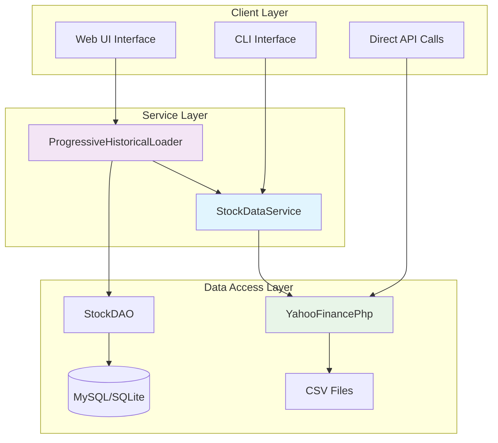

# 📚 **API Documentation**

## **Overview**

This document provides comprehensive API documentation for the ChatGPT Micro-Cap Experiment's PHP-native stock data system. The system consists of three primary components that work together to provide robust stock data retrieval, processing, and management capabilities.

---

## **🏗️ Architecture Overview**



---

## **📖 Core API Classes**

### **1. YahooFinancePhp Class**

The foundational class for fetching stock data directly from Yahoo Finance API.

#### **Constructor**
```php
public function __construct()
```
- Initializes HTTP client with proper headers and timeout settings
- Sets up SSL verification and user agent for Yahoo Finance compatibility

#### **Main Methods**

##### **fetchHistoricalData($symbol, $startDate, $endDate)**
Fetches historical stock data for a given symbol and date range.

**Parameters:**
- `$symbol` (string): Stock ticker symbol (e.g., "AAPL", "MSFT")
- `$startDate` (string): Start date in 'Y-m-d' format (e.g., "2023-01-01")
- `$endDate` (string): End date in 'Y-m-d' format (e.g., "2023-12-31")

**Returns:**
```php
[
    'symbol' => 'AAPL',
    'start_date' => '2023-01-01',
    'end_date' => '2023-12-31',
    'data' => [
        [
            'Date' => '2023-01-01',
            'Open' => 130.25,
            'High' => 135.50,
            'Low' => 129.75,
            'Close' => 133.41,
            'Adj Close' => 133.41,
            'Volume' => 85467200
        ],
        // ... more records
    ],
    'count' => 252
]
```

**Example Usage:**
```php
<?php
require_once 'YahooFinancePhp.php';

$yahoo = new YahooFinancePhp();

try {
    $data = $yahoo->fetchHistoricalData('AAPL', '2023-01-01', '2023-12-31');
    echo "Retrieved {$data['count']} records for {$data['symbol']}\n";
    
    // Display first record
    $first = $data['data'][0];
    echo "First trading day: {$first['Date']} - Close: \${$first['Close']}\n";
    
} catch (Exception $e) {
    echo "Error: " . $e->getMessage();
}
?>
```

##### **saveToCSV($data, $filename = null)**
Saves stock data to a CSV file in the standard format.

**Parameters:**
- `$data` (array): Data array returned from `fetchHistoricalData()`
- `$filename` (string, optional): Custom filename. If null, generates automatically

**Returns:**
- `string`: Full path to the saved CSV file

**Example Usage:**
```php
$data = $yahoo->fetchHistoricalData('MSFT', '2023-01-01', '2023-06-30');
$csvPath = $yahoo->saveToCSV($data);
echo "Data saved to: {$csvPath}\n";

// Custom filename
$customPath = $yahoo->saveToCSV($data, 'my_stock_data.csv');
```

##### **testConnection()**
Tests connectivity to Yahoo Finance servers.

**Returns:**
- `bool`: True if connection successful, false otherwise

**Example Usage:**
```php
if ($yahoo->testConnection()) {
    echo "Yahoo Finance is accessible\n";
} else {
    echo "Cannot connect to Yahoo Finance\n";
}
```

#### **CLI Interface**
YahooFinancePhp can be used directly from command line:

```bash
# Basic usage
php YahooFinancePhp.php AAPL 2023-01-01 2023-12-31

# Save to CSV
php YahooFinancePhp.php AAPL 2023-01-01 2023-12-31 --save-csv

# Output as JSON
php YahooFinancePhp.php AAPL 2023-01-01 2023-12-31 --json

# Combined options
php YahooFinancePhp.php MSFT 2023-01-01 2023-12-31 --save-csv --json
```

---

### **2. StockDataService Class**

A wrapper service that provides enhanced functionality and compatibility with existing Python-based systems.

#### **Constructor**
```php
public function __construct($debug = false)
```
**Parameters:**
- `$debug` (bool): Enable debug logging (default: false)

#### **Main Methods**

##### **fetchHistoricalData($symbol, $startDate, $endDate)**
Enhanced version of data fetching with Python script compatibility.

**Parameters:**
- `$symbol` (string): Stock ticker symbol
- `$startDate` (string): Start date in 'Y-m-d' format
- `$endDate` (string): End date in 'Y-m-d' format

**Returns:**
JSON string with structured response:
```json
{
    "success": true,
    "symbol": "AAPL",
    "start_date": "2023-01-01",
    "end_date": "2023-12-31",
    "total_records": 252,
    "data": [
        {
            "Date": "2023-01-01",
            "Open": 130.25,
            "High": 135.50,
            "Low": 129.75,
            "Close": 133.41,
            "Adj Close": 133.41,
            "Volume": 85467200
        }
    ],
    "source": "PHP_YahooFinance"
}
```

**Error Response:**
```json
{
    "success": false,
    "error": "Error message details",
    "symbol": "AAPL",
    "source": "PHP_YahooFinance"
}
```

**Example Usage:**
```php
<?php
require_once 'StockDataService.php';

$service = new StockDataService(true); // Enable debug mode

$result = $service->fetchHistoricalData('GOOGL', '2023-01-01', '2023-03-31');
$data = json_decode($result, true);

if ($data['success']) {
    echo "Successfully retrieved {$data['total_records']} records\n";
    echo "Date range: {$data['start_date']} to {$data['end_date']}\n";
} else {
    echo "Error: {$data['error']}\n";
}
?>
```

##### **saveToCSV($jsonData, $filename = null)**
Saves JSON response data to CSV format.

**Parameters:**
- `$jsonData` (string): JSON response from `fetchHistoricalData()`
- `$filename` (string, optional): Custom filename

**Returns:**
- `string`: Path to saved CSV file

**Example Usage:**
```php
$jsonResult = $service->fetchHistoricalData('TSLA', '2023-01-01', '2023-12-31');
$csvPath = $service->saveToCSV($jsonResult);
echo "CSV saved to: {$csvPath}\n";
```

##### **getChunkedData($symbol, $startDate, $endDate, $chunkMonths = 6)**
Splits large date ranges into manageable chunks for progressive loading.

**Parameters:**
- `$symbol` (string): Stock ticker symbol
- `$startDate` (string): Start date
- `$endDate` (string): End date
- `$chunkMonths` (int): Number of months per chunk (default: 6)

**Returns:**
```php
[
    ['start' => '2023-01-01', 'end' => '2023-06-30'],
    ['start' => '2023-07-01', 'end' => '2023-12-31']
]
```

**Example Usage:**
```php
$chunks = $service->getChunkedData('AMZN', '2020-01-01', '2023-12-31', 12);
foreach ($chunks as $chunk) {
    echo "Chunk: {$chunk['start']} to {$chunk['end']}\n";
}
```

##### **fetchChunkData($symbol, $chunkStart, $chunkEnd)**
Fetches data for a specific chunk period.

**Parameters:**
- `$symbol` (string): Stock ticker symbol
- `$chunkStart` (string): Chunk start date
- `$chunkEnd` (string): Chunk end date

**Returns:**
- JSON string with chunk data (same format as `fetchHistoricalData`)

##### **testConnection()**
Tests Yahoo Finance connectivity through the underlying YahooFinancePhp client.

**Returns:**
- `bool`: Connection status

#### **CLI Interface**
```bash
# Basic usage
php StockDataService.php AAPL 2023-01-01 2023-12-31

# Save to CSV
php StockDataService.php AAPL 2023-01-01 2023-12-31 --save-csv

# Show detailed data
php StockDataService.php AAPL 2023-01-01 2023-12-31 --show-data

# Combined options
php StockDataService.php MSFT 2023-01-01 2023-12-31 --save-csv --show-data
```

---

### **3. ProgressiveHistoricalLoader Class**

Advanced loader for fetching complete historical datasets in chunks, with database integration and progress tracking.

#### **Constructor**
```php
public function __construct($database, $logger = null)
```
**Parameters:**
- `$database` (PDO): Database connection object
- `$logger` (object, optional): Custom logger instance

#### **Main Methods**

##### **loadAllHistoricalData($symbol, $startFromDate = null)**
Loads complete historical data for a symbol, handling Yahoo Finance limitations automatically.

**Parameters:**
- `$symbol` (string): Stock ticker symbol
- `$startFromDate` (string, optional): Custom start date. If null, calculates optimal start

**Returns:**
```php
[
    'success' => true,
    'symbol' => 'AAPL',
    'chunks_processed' => 5,
    'total_records' => 1250,
    'date_range' => [
        'oldest' => '2018-01-01',
        'newest' => '2023-12-31'
    ]
]
```

**Error Response:**
```php
[
    'success' => false,
    'error' => 'Error message',
    'symbol' => 'AAPL'
]
```

**Example Usage:**
```php
<?php
require_once 'ProgressiveHistoricalLoader.php';
require_once 'web_ui/UserAuthDAO.php';

// Get database connection
$auth = new UserAuthDAO();
$db = $auth->getPdo();

// Create logger
$logger = new SimpleLogger();

// Initialize loader
$loader = new ProgressiveHistoricalLoader($db, $logger);

// Load all historical data for Apple
$result = $loader->loadAllHistoricalData('AAPL');

if ($result['success']) {
    echo "Success! Processed {$result['chunks_processed']} chunks\n";
    echo "Total records: {$result['total_records']}\n";
    echo "Date range: {$result['date_range']['oldest']} to {$result['date_range']['newest']}\n";
} else {
    echo "Error: {$result['error']}\n";
}
?>
```

##### **loadMultipleSymbols($symbols)**
Loads historical data for multiple symbols sequentially.

**Parameters:**
- `$symbols` (array): Array of stock ticker symbols

**Returns:**
```php
[
    'AAPL' => ['success' => true, 'records' => 1250],
    'MSFT' => ['success' => true, 'records' => 1180],
    'GOOGL' => ['success' => false, 'error' => 'Symbol not found']
]
```

**Example Usage:**
```php
$symbols = ['AAPL', 'MSFT', 'GOOGL', 'TSLA'];
$results = $loader->loadMultipleSymbols($symbols);

foreach ($results as $symbol => $result) {
    if ($result['success']) {
        echo "{$symbol}: {$result['records']} records loaded\n";
    } else {
        echo "{$symbol}: Error - {$result['error']}\n";
    }
}
```

##### **getProgressInfo($symbol)**
Retrieves loading progress information for a symbol.

**Parameters:**
- `$symbol` (string): Stock ticker symbol

**Returns:**
```php
[
    'symbol' => 'AAPL',
    'total_records' => 1250,
    'date_range' => [
        'oldest' => '2018-01-01',
        'newest' => '2023-12-31'
    ],
    'data_gaps' => [
        ['start' => '2019-06-01', 'end' => '2019-06-15']
    ],
    'completion_percentage' => 98.5
]
```

**Example Usage:**
```php
$progress = $loader->getProgressInfo('AAPL');
echo "Symbol: {$progress['symbol']}\n";
echo "Records: {$progress['total_records']}\n";
echo "Completion: {$progress['completion_percentage']}%\n";

if (!empty($progress['data_gaps'])) {
    echo "Data gaps found:\n";
    foreach ($progress['data_gaps'] as $gap) {
        echo "  {$gap['start']} to {$gap['end']}\n";
    }
}
```

##### **hasDataForPeriod($symbol, $startDate, $endDate)**
Checks if data already exists for a specific period.

**Parameters:**
- `$symbol` (string): Stock ticker symbol
- `$startDate` (DateTime|string): Start date
- `$endDate` (DateTime|string): End date

**Returns:**
- `bool`: True if data exists for the period

##### **estimateIPODate($symbol)**
Estimates IPO date for a symbol to determine optimal historical data start point.

**Parameters:**
- `$symbol` (string): Stock ticker symbol

**Returns:**
- `DateTime|null`: Estimated IPO date or null if unknown

---

## **🔧 Configuration & Setup**

### **Environment Requirements**
- **PHP 8.4+** with extensions: `pdo_sqlite`, `pdo_mysql`, `json`, `curl`, `mbstring`
- **Composer** for dependency management
- **Guzzle HTTP** client library
- **MySQL 8.0+** (production) or **SQLite 3.0+** (development)

### **Installation**
```bash
# Install Composer dependencies
composer install

# Verify PHP extensions
php -m | grep -E "(pdo_sqlite|pdo_mysql|json|curl|mbstring)"

# Test Yahoo Finance connectivity
php YahooFinancePhp.php --test-connection
```

### **Configuration Files**
- `composer.json` - PHP dependency configuration
- `web_ui/config.php` - Database and system configuration
- `.htaccess` - Web server configuration (if using Apache)

---

## **📊 Usage Examples**

### **Basic Stock Data Retrieval**
```php
<?php
// Simple one-time data fetch
require_once 'YahooFinancePhp.php';

$yahoo = new YahooFinancePhp();
$data = $yahoo->fetchHistoricalData('AAPL', '2023-01-01', '2023-12-31');

echo "Retrieved {$data['count']} records for Apple Inc.\n";
echo "Price on first day: \${$data['data'][0]['Close']}\n";
echo "Price on last day: \${$data['data'][-1]['Close']}\n";
?>
```

### **Service-Layer Integration**
```php
<?php
// Using StockDataService for enhanced functionality
require_once 'StockDataService.php';

$service = new StockDataService(true);

// Fetch data with error handling
$jsonResult = $service->fetchHistoricalData('TSLA', '2023-01-01', '2023-12-31');
$result = json_decode($jsonResult, true);

if ($result['success']) {
    // Save to CSV
    $csvPath = $service->saveToCSV($jsonResult);
    echo "Tesla data saved to: {$csvPath}\n";
    
    // Display summary
    $data = $result['data'];
    $firstPrice = $data[0]['Close'];
    $lastPrice = end($data)['Close'];
    $return = (($lastPrice - $firstPrice) / $firstPrice) * 100;
    
    echo sprintf("TSLA 2023 Performance: %.2f%%\n", $return);
} else {
    echo "Failed to fetch Tesla data: {$result['error']}\n";
}
?>
```

### **Progressive Historical Loading**
```php
<?php
// Loading complete historical data with progress tracking
require_once 'ProgressiveHistoricalLoader.php';
require_once 'web_ui/UserAuthDAO.php';

$auth = new UserAuthDAO();
$db = $auth->getPdo();
$loader = new ProgressiveHistoricalLoader($db);

// Load multiple symbols from portfolio
$portfolioSymbols = ['AAPL', 'MSFT', 'GOOGL', 'AMZN', 'TSLA'];

echo "Starting progressive load for portfolio...\n";

foreach ($portfolioSymbols as $symbol) {
    echo "Processing {$symbol}...\n";
    
    $result = $loader->loadAllHistoricalData($symbol);
    
    if ($result['success']) {
        echo "  ✓ {$symbol}: {$result['total_records']} records loaded\n";
    } else {
        echo "  ✗ {$symbol}: {$result['error']}\n";
    }
    
    // Brief delay to respect rate limits
    sleep(2);
}

echo "Portfolio historical data loading completed!\n";
?>
```

### **Web Interface Integration**
```php
<?php
// Example AJAX endpoint for web interface
header('Content-Type: application/json');

if ($_SERVER['REQUEST_METHOD'] === 'POST') {
    $symbol = $_POST['symbol'] ?? '';
    $startDate = $_POST['start_date'] ?? '';
    $endDate = $_POST['end_date'] ?? '';
    
    if (empty($symbol)) {
        echo json_encode(['error' => 'Symbol required']);
        exit;
    }
    
    try {
        require_once '../StockDataService.php';
        
        $service = new StockDataService();
        $result = $service->fetchHistoricalData($symbol, $startDate, $endDate);
        
        echo $result; // Already JSON formatted
        
    } catch (Exception $e) {
        echo json_encode([
            'success' => false,
            'error' => $e->getMessage()
        ]);
    }
}
?>
```

---

## **🚨 Error Handling**

### **Common Error Types**

#### **Connection Errors**
```php
try {
    $data = $yahoo->fetchHistoricalData('AAPL', '2023-01-01', '2023-12-31');
} catch (Exception $e) {
    if (strpos($e->getMessage(), 'HTTP request failed') !== false) {
        echo "Network connectivity issue: Check internet connection\n";
    } elseif (strpos($e->getMessage(), 'timeout') !== false) {
        echo "Request timeout: Yahoo Finance may be slow\n";
    }
}
```

#### **Data Validation Errors**
```php
// Invalid date format
try {
    $data = $yahoo->fetchHistoricalData('AAPL', 'invalid-date', '2023-12-31');
} catch (Exception $e) {
    if (strpos($e->getMessage(), 'Invalid date format') !== false) {
        echo "Error: Please use YYYY-MM-DD date format\n";
    }
}
```

#### **Symbol Not Found**
```php
try {
    $data = $yahoo->fetchHistoricalData('INVALID_SYMBOL', '2023-01-01', '2023-12-31');
} catch (Exception $e) {
    if (strpos($e->getMessage(), 'No data returned') !== false) {
        echo "Symbol not found or delisted\n";
    }
}
```

### **Best Practices**
1. **Always use try-catch blocks** for external API calls
2. **Validate input dates** before making requests
3. **Implement retry logic** for transient network errors
4. **Log errors** for debugging and monitoring
5. **Set appropriate timeouts** for production environments

---

## **⚡ Performance Considerations**

### **Rate Limiting**
- Yahoo Finance has rate limits (~2000 requests/hour)
- ProgressiveHistoricalLoader includes built-in delays
- For high-volume usage, implement request queuing

### **Memory Management**
```php
// For large datasets, process in chunks
$chunks = $service->getChunkedData('AAPL', '2000-01-01', '2023-12-31', 12);

foreach ($chunks as $chunk) {
    $data = $service->fetchChunkData('AAPL', $chunk['start'], $chunk['end']);
    
    // Process chunk immediately
    processChunkData($data);
    
    // Free memory
    unset($data);
    
    // Rate limit delay
    sleep(2);
}
```

### **Database Optimization**
- Use appropriate indexes on date and symbol columns
- Consider data archival strategies for very old data
- Implement database connection pooling for high concurrency

### **Caching Strategies**
```php
// Example Redis caching for frequently accessed data
class CachedStockService extends StockDataService {
    private $redis;
    
    public function __construct($debug = false) {
        parent::__construct($debug);
        $this->redis = new Redis();
        $this->redis->connect('127.0.0.1', 6379);
    }
    
    public function fetchHistoricalData($symbol, $startDate, $endDate) {
        $cacheKey = "stock_data_{$symbol}_{$startDate}_{$endDate}";
        
        // Try cache first
        $cached = $this->redis->get($cacheKey);
        if ($cached !== false) {
            return $cached;
        }
        
        // Fetch from API
        $result = parent::fetchHistoricalData($symbol, $startDate, $endDate);
        
        // Cache for 1 hour
        $this->redis->setex($cacheKey, 3600, $result);
        
        return $result;
    }
}
```

---

## **📋 API Reference Summary**

| Class | Method | Purpose | Returns |
|-------|--------|---------|---------|
| `YahooFinancePhp` | `fetchHistoricalData()` | Get stock data from Yahoo Finance | Array |
| | `saveToCSV()` | Save data to CSV file | String (file path) |
| | `testConnection()` | Test Yahoo Finance connectivity | Boolean |
| `StockDataService` | `fetchHistoricalData()` | Enhanced data fetch with JSON response | JSON String |
| | `saveToCSV()` | Save JSON data to CSV | String (file path) |
| | `getChunkedData()` | Split date range into chunks | Array |
| | `fetchChunkData()` | Fetch data for specific chunk | JSON String |
| `ProgressiveHistoricalLoader` | `loadAllHistoricalData()` | Load complete historical dataset | Array |
| | `loadMultipleSymbols()` | Load data for multiple symbols | Array |
| | `getProgressInfo()` | Get loading progress status | Array |
| | `hasDataForPeriod()` | Check if data exists for period | Boolean |

---

## **🔗 Related Documentation**

- **[📋 Technical Requirements](Technical_Requirements.md)** - System specifications and requirements
- **[🏗️ Architecture Documentation](Architecture_Documentation.md)** - System architecture and design
- **[📖 User Guide](../README.md)** - Installation and usage instructions
- **[🧪 Testing Guide](../tests/README.md)** - Testing procedures and validation

---

*Last Updated: September 27, 2025*  
*Version: 1.0.0*  
*Compatibility: PHP 8.4+, MySQL 8.0+, SQLite 3.0+*