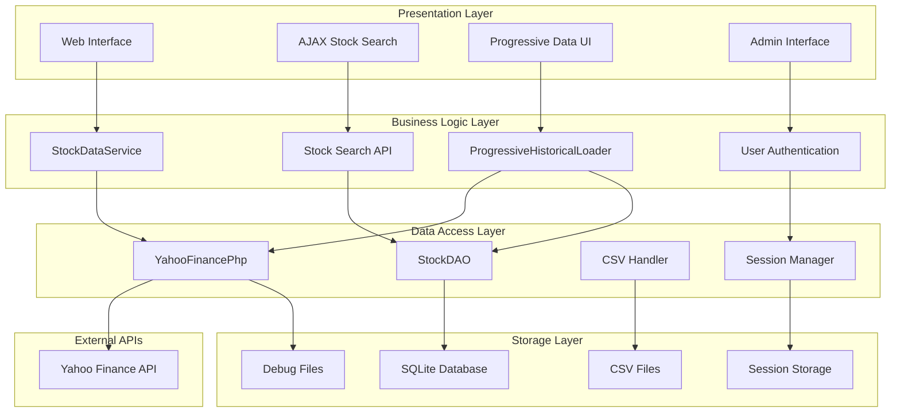

# Architecture Documentation
## ChatGPT Micro-Cap Experiment - PHP Native Platform

**Document Version:** 2.0  
**Last Updated:** September 27, 2025  
**Architecture Version:** PHP Native 2.0

---

## 1. Executive Summary

The ChatGPT Micro-Cap Experiment platform has been redesigned as a fully PHP-native solution that eliminates external dependencies while maintaining comprehensive stock data retrieval and analysis capabilities. This document describes the complete system architecture, data flows, and component interactions.

### 1.1 Architecture Evolution

#### **Previous Architecture (v1.x)**
```
Web UI (PHP) → Python Script → yfinance → Yahoo Finance API
     ↓
  MySQL Database
```

#### **Current Architecture (v2.0)**
```
Web UI (PHP) → StockDataService → YahooFinancePhp → Yahoo Finance API
     ↓               ↓                    ↓
SQLite Database   data/csv/         data/debug/
```

### 1.2 Key Architectural Benefits
- **🔄 Simplified Deployment:** Single runtime environment (PHP)
- **⚡ Improved Performance:** Direct API integration without subprocess overhead
- **🗄️ Embedded Database:** SQLite eliminates external database dependencies
- **📊 Organized Storage:** Structured data directory for exports and debugging

---

## 2. System Architecture Overview

### 2.1 High-Level Architecture Diagram



### 2.2 Component Layer Details

#### **Presentation Layer**
| Component | Purpose | Technology | Files |
|-----------|---------|------------|-------|
| Web Interface | Main application UI | HTML5, CSS3, JavaScript | `web_ui/*.php` |
| AJAX Stock Search | Real-time stock symbol search | JavaScript, JSON API | `stock_search.php` |
| Progressive Data UI | Historical data loading interface | PHP, AJAX | `progressive_data_loader.php` |
| Admin Interface | Administrative functions | PHP, Authentication | `web_ui/admin/` |

#### **Business Logic Layer**
| Component | Purpose | Technology | Files |
|-----------|---------|------------|-------|
| StockDataService | Stock data orchestration | PHP Classes | `StockDataService.php` |
| ProgressiveHistoricalLoader | Chunked data loading | PHP Classes | `ProgressiveHistoricalLoader.php` |
| Stock Search API | Symbol and company search | PHP, JSON API | `stock_search.php` |
| User Authentication | Security and session management | PHP, Sessions | `UserAuthDAO.php` |

#### **Data Access Layer**
| Component | Purpose | Technology | Files |
|-----------|---------|------------|-------|
| YahooFinancePhp | Yahoo Finance API client | PHP, Guzzle HTTP | `YahooFinancePhp.php` |
| StockDAO | Database operations | PHP, PDO | `StockDAO.php` |
| CSV Handler | File import/export | PHP, CSV parsing | Integrated in services |
| Session Manager | User session handling | PHP Sessions | Integrated in auth |

---

## 3. Detailed Component Architecture

### 3.1 YahooFinancePhp Class Architecture

```php
/**
 * Yahoo Finance API Client
 * 
 * Responsibilities:
 * - Direct HTTP communication with Yahoo Finance API
 * - Response parsing and validation
 * - CSV export functionality
 * - Connection management and error handling
 */
class YahooFinancePhp {
    private $client;           // Guzzle HTTP client
    private $baseUrl;         // Yahoo Finance API endpoint
    
    // Core Methods
    public function fetchHistoricalData($symbol, $startDate, $endDate)
    public function parseYahooData($result, $symbol)  
    public function saveToCSV($data, $filename = null)
    public function testConnection()
}
```

#### **Data Flow: Stock Data Retrieval**
```
1. User Request → StockDataService::fetchHistoricalData()
2. Service → YahooFinancePhp::fetchHistoricalData()
3. HTTP Client → Yahoo Finance API (HTTPS)
4. API Response → parseYahooData()
5. Parsed Data → JSON Format
6. Optional: saveToCSV() → data/csv/
7. Debug Info → data/debug/
8. Return → JSON Response to caller
```

#### **Error Handling Flow**
```
HTTP Error → RequestException → Service Error Response
Network Timeout → TimeoutException → Retry Logic
Invalid Response → ParseException → Error Log + Fallback
SSL Error → SSLException → Certificate Bypass (dev mode)
```

### 3.2 StockDataService Architecture

```php
/**
 * Stock Data Service Layer
 * 
 * Responsibilities:
 * - Service orchestration and business logic
 * - Data format standardization
 * - Error handling and logging
 * - Integration with legacy systems
 */
class StockDataService {
    private $yahooClient;      // YahooFinancePhp instance
    private $debug;           // Debug mode flag
    
    // Core Methods  
    public function fetchHistoricalData($symbol, $startDate, $endDate)
    public function saveToCSV($jsonData, $filename = null)
    public function testConnection()
    public function getChunkedData($symbol, $startDate, $endDate, $chunkMonths = 6)
    public function fetchChunkData($symbol, $chunkStart, $chunkEnd)
}
```

#### **Service Integration Pattern**
```
Legacy Python Interface → StockDataService → PHP Implementation
    ↓                         ↓                    ↓
JSON Response Format    Service Layer Logic   Direct API Calls
(Compatibility)         (Business Rules)      (Performance)
```

### 3.3 ProgressiveHistoricalLoader Architecture

```php
/**
 * Progressive Historical Data Loader
 * 
 * Responsibilities:
 * - Chunked data loading for large date ranges
 * - Database integration and data persistence
 * - Progress tracking and user feedback
 * - CSV processing and data import
 */
class ProgressiveHistoricalLoader {
    private $stockDAO;         // Database operations
    private $logger;           // Logging service
    private $stockDataService; // Stock data service
    private $maxYears = 5;     // Yahoo Finance limit
    private $delayBetweenRequests = 2; // Rate limiting
    
    // Core Methods
    public function loadAllHistoricalData($symbol, $startFromDate = null)
    private function fetchChunkData($symbol, $startDate, $endDate)
    public function processCsvFiles($csvDirectory)
    private function mapCsvColumns($headers)
}
```

#### **Progressive Loading Flow**
```
1. Calculate Date Chunks → 6-month segments
2. For Each Chunk:
   a. fetchChunkData() → StockDataService
   b. Parse Response → Validate Data
   c. Store in Database → stockDAO.upsertPriceData()
   d. Update Progress → UI Feedback
   e. Delay → Rate Limiting (2 seconds)
3. Aggregate Results → Final Report
```

---

## 4. Data Architecture

### 4.1 Database Schema Design

#### **SQLite Database Structure**
```sql
-- Dynamic table creation per symbol
-- Table name pattern: {SYMBOL}_prices

CREATE TABLE IF NOT EXISTS AAPL_prices (
    id INTEGER PRIMARY KEY AUTOINCREMENT,
    date DATE NOT NULL UNIQUE,
    open DECIMAL(10,4) NOT NULL,
    high DECIMAL(10,4) NOT NULL, 
    low DECIMAL(10,4) NOT NULL,
    close DECIMAL(10,4) NOT NULL,
    volume BIGINT NOT NULL,
    created_at TIMESTAMP DEFAULT CURRENT_TIMESTAMP,
    updated_at TIMESTAMP DEFAULT CURRENT_TIMESTAMP
);

-- Index for date-based queries
CREATE INDEX IF NOT EXISTS idx_AAPL_prices_date ON AAPL_prices(date);

-- Stocks registry table
CREATE TABLE IF NOT EXISTS stocks (
    id INTEGER PRIMARY KEY AUTOINCREMENT,
    symbol VARCHAR(10) NOT NULL UNIQUE,
    name VARCHAR(255),
    sector VARCHAR(100),
    market_cap BIGINT,
    created_at TIMESTAMP DEFAULT CURRENT_TIMESTAMP,
    updated_at TIMESTAMP DEFAULT CURRENT_TIMESTAMP
);
```

#### **Data Relationships**
```
stocks (registry)
   ↓ 1:1
{SYMBOL}_prices (price data)
   ↓ 1:N  
CSV Exports (data/csv/)
   ↓ 1:N
Debug Logs (data/debug/)
```

### 4.2 File System Data Organization

#### **Directory Structure**
```
data/
├── csv/                          # Stock data exports
│   ├── AAPL_2024-01-01_to_2024-12-31.csv
│   ├── IBM_2020-01-01_to_2024-09-27.csv
│   └── MSFT_2024-09-01_to_2024-09-27.csv
├── debug/                        # API response debugging  
│   ├── debug_output_AAPL_2024-01-01.json
│   └── debug_output_IBM_2024-01-01.json
└── README.md                     # Directory documentation
```

#### **CSV File Format Specification**
```csv
Date,Open,High,Low,Close,Adj Close,Volume
2024-01-02,162.83,163.29,160.46,161.50,161.50,3825000
2024-01-03,161.00,161.73,160.08,160.10,160.10,4086100
# Format: ISO date, decimal prices (4 places), integer volume
# Encoding: UTF-8
# Line endings: CRLF (Windows) or LF (Unix)
```

#### **Debug File Format Specification**
```json
{
  "success": true,
  "symbol": "AAPL",
  "start_date": "2024-01-02",
  "end_date": "2024-12-31", 
  "total_records": 252,
  "data": [
    {
      "Date": "2024-01-02",
      "Open": 162.83,
      "High": 163.29,
      "Low": 160.46,
      "Close": 161.50,
      "Adj Close": 161.50,
      "Volume": 3825000
    }
  ],
  "source": "PHP_YahooFinance"
}
```

---

## 5. API Architecture

### 5.1 Yahoo Finance API Integration

#### **API Endpoint Specifications**
```
Base URL: https://query1.finance.yahoo.com/v8/finance/chart/{symbol}

Request Parameters:
- period1: Unix timestamp (start date)
- period2: Unix timestamp (end date)
- interval: Data interval (1d, 1wk, 1mo)
- includePrePost: Extended hours (true/false)
- events: Corporate actions (div,splits)

Example Request:
GET https://query1.finance.yahoo.com/v8/finance/chart/AAPL?period1=1640995200&period2=1672531200&interval=1d&includePrePost=true&events=div,splits
```

#### **HTTP Client Configuration**
```php
// Guzzle HTTP Client Settings
$client = new Client([
    'timeout' => 30,                    // 30-second timeout
    'verify' => false,                  // SSL verification (dev mode)
    'headers' => [
        'User-Agent' => 'Mozilla/5.0 (Windows NT 10.0; Win64; x64) AppleWebKit/537.36'
    ]
]);
```

#### **Response Processing Pipeline**
```
1. HTTP Response → JSON Decode
2. Validate Structure → Check 'chart.result[0]'
3. Extract Metadata → Symbol, timezone, etc.
4. Process Timestamps → Convert Unix to ISO dates
5. Extract Price Data → OHLCV arrays
6. Validate Data → Check for nulls, sort by date
7. Format Output → Standardized JSON structure
```

### 5.2 Internal API Design

#### **StockDataService API**
```php
// Public interface methods with standardized responses

/**
 * Fetch Historical Data
 * @param string $symbol Stock symbol (e.g., 'AAPL')  
 * @param string $startDate ISO date (YYYY-MM-DD)
 * @param string $endDate ISO date (YYYY-MM-DD)
 * @return string JSON response
 */
public function fetchHistoricalData($symbol, $startDate, $endDate): string

/**
 * Save to CSV
 * @param string $jsonData Stock data in JSON format
 * @param string|null $filename Optional custom filename
 * @return string Full path to created CSV file
 */
public function saveToCSV($jsonData, $filename = null): string

/**
 * Test Connection
 * @return bool True if Yahoo Finance API accessible
 */
public function testConnection(): bool
```

#### **Response Format Standards**
```json
// Success Response
{
  "success": true,
  "symbol": "AAPL",
  "start_date": "2024-01-02", 
  "end_date": "2024-12-31",
  "total_records": 252,
  "data": [...],
  "source": "PHP_YahooFinance"
}

// Error Response
{
  "success": false,
  "error": "HTTP request failed: cURL error 28",
  "symbol": "INVALID",
  "source": "PHP_YahooFinance"
}
```

---

## 6. Security Architecture

### 6.1 Security Layers

#### **Network Security**
```
Internet → HTTPS → Web Server → PHP Application
    ↓        ↓         ↓            ↓
SSL/TLS  Certificate  Firewall   Input Validation
Encryption Validation  Rules    Sanitization
```

#### **Application Security**
- **Input Validation:** All user inputs sanitized and validated
- **SQL Injection Prevention:** PDO prepared statements only  
- **XSS Protection:** Output escaping for all dynamic content
- **CSRF Protection:** Token validation for state-changing operations
- **Session Security:** Secure session configuration and timeout

#### **Data Security**
- **File Permissions:** Restricted access to data directory
- **Path Traversal Prevention:** Input validation for file operations
- **Temporary File Cleanup:** Secure cleanup of temporary files
- **Debug Information:** No sensitive data in debug logs

### 6.2 Authentication Architecture

#### **User Authentication Flow**
```
1. User Login → Credentials Validation
2. Password Hash → bcrypt verification  
3. Session Creation → Secure session ID
4. CSRF Token → Anti-forgery protection
5. Access Control → Role-based permissions
6. Session Timeout → Automatic logout
```

#### **Session Management**
```php
// Session configuration
session_set_cookie_params([
    'lifetime' => 3600,           // 1 hour timeout
    'path' => '/',
    'domain' => '',
    'secure' => true,             // HTTPS only in production  
    'httponly' => true,           // No JavaScript access
    'samesite' => 'Strict'        // CSRF protection
]);
```

---

## 7. Performance Architecture

### 7.1 Performance Optimization Strategies

#### **Database Performance**
- **SQLite Optimizations:** WAL mode, proper indexing, query optimization
- **Connection Management:** Persistent connections, connection pooling
- **Query Optimization:** Prepared statements, indexed columns, efficient joins
- **Data Partitioning:** Separate tables per symbol for large datasets

#### **HTTP Performance**  
- **Connection Reuse:** Keep-alive connections for API calls
- **Timeout Management:** Appropriate timeouts to prevent hanging
- **Retry Logic:** Exponential backoff for failed requests
- **Rate Limiting:** Respect API limits to prevent throttling

#### **Memory Management**
- **Streaming Processing:** Process large files in chunks
- **Memory Monitoring:** Track memory usage and cleanup
- **Garbage Collection:** Explicit object cleanup for long-running processes
- **Resource Limits:** Configure PHP memory limits appropriately

### 7.2 Caching Architecture

#### **File-Based Caching Strategy**
```
Recent Data (< 1 day) → No Caching (Real-time)
Historical Data (> 1 day) → CSV File Cache
Debug Information → Persistent Debug Files
Configuration → In-memory caching
```

#### **Cache Invalidation Rules**
- **Real-time Data:** No caching during market hours
- **Historical Data:** Cache indefinitely (immutable)
- **Debug Files:** Retain for 30 days, then cleanup
- **Configuration:** Cache until application restart

---

## 8. Deployment Architecture

### 8.1 Deployment Models

#### **Development Deployment**
```
Single Server:
- PHP Built-in Server (php -S localhost:8000)
- SQLite Database (file-based)
- Local file system for data storage
- Debug mode enabled
```

#### **Production Deployment**  
```
Web Server Tier:
- Apache/Nginx with PHP-FPM
- SSL/TLS termination
- Load balancer (optional)

Application Tier:
- PHP 8.4+ with required extensions
- Composer dependencies
- Optimized autoloader

Data Tier:
- SQLite (small scale) or PostgreSQL (large scale)
- Backup and recovery procedures
- Data directory on persistent storage
```

#### **Containerized Deployment**
```dockerfile
# Docker deployment architecture
FROM php:8.4-apache
COPY . /var/www/html/
RUN composer install --no-dev --optimize-autoloader
VOLUME ["/var/www/html/data"]
EXPOSE 80
```

### 8.2 Configuration Management

#### **Environment-Specific Configuration**
```php
// config/app.php
return [
    'environment' => getenv('APP_ENV') ?: 'development',
    'debug' => getenv('APP_DEBUG') === 'true',
    'yahoo_finance' => [
        'timeout' => (int)getenv('YAHOO_TIMEOUT') ?: 30,
        'verify_ssl' => getenv('YAHOO_SSL_VERIFY') !== 'false',
    ],
    'database' => [
        'path' => getenv('DB_PATH') ?: __DIR__ . '/../web_ui/stocks.db',
        'backup' => getenv('DB_BACKUP') === 'true',
    ],
];
```

#### **Deployment Checklist**
- [ ] PHP 8.4+ installed with required extensions
- [ ] Composer dependencies installed
- [ ] Web server configured (document root: web_ui/)
- [ ] File permissions set correctly (644/755)
- [ ] Data directory writable by web server
- [ ] SSL certificate configured (production)
- [ ] Error logging configured
- [ ] Monitoring and health checks enabled

---

## 9. Monitoring and Observability

### 9.1 Application Monitoring

#### **Health Check Endpoints**
```php
// Health check implementation
GET /health
Response:
{
  "status": "healthy",
  "version": "2.0.0", 
  "components": {
    "database": "ok",
    "yahoo_api": "ok",
    "file_system": "ok"
  },
  "timestamp": "2025-09-27T16:00:00Z"
}
```

#### **Performance Metrics**
- **Response Times:** API call duration, database query time
- **Throughput:** Requests per second, symbols processed per hour  
- **Error Rates:** Failed API calls, database errors, file system errors
- **Resource Usage:** Memory consumption, disk space usage

### 9.2 Logging Architecture

#### **Log Levels and Categories**
```php
// Logging configuration
LOG_LEVELS = [
    'ERROR'   => 'System errors, exceptions',
    'WARNING' => 'Performance issues, retry attempts', 
    'INFO'    => 'Normal operations, user actions',
    'DEBUG'   => 'Detailed debugging information'
];

LOG_CATEGORIES = [
    'API'      => 'Yahoo Finance API interactions',
    'DATABASE' => 'Database operations and queries',
    'AUTH'     => 'Authentication and authorization',
    'FILES'    => 'File system operations'
];
```

#### **Log Retention and Management**
- **Error Logs:** 90 days retention minimum
- **Access Logs:** 30 days for performance analysis
- **Debug Logs:** 7 days (development), disabled (production)
- **Audit Logs:** 1 year for compliance tracking

---

## 10. Future Architecture Considerations

### 10.1 Scalability Enhancements

#### **Horizontal Scaling Opportunities**
- **API Gateway:** Centralized API management and rate limiting
- **Microservices:** Split components into independent services
- **Message Queue:** Asynchronous processing for large datasets
- **Caching Layer:** Redis/Memcached for improved performance

#### **Data Architecture Evolution**
- **Time Series Database:** InfluxDB for high-frequency data
- **Data Warehouse:** Analytics and reporting platform
- **Data Lakes:** Long-term historical data storage
- **Real-time Streaming:** Apache Kafka for live data feeds

### 10.2 Technology Roadmap

#### **Short-term Enhancements (3-6 months)**
- PHPUnit test suite implementation
- Performance monitoring dashboard
- Automated backup and recovery
- Docker containerization

#### **Medium-term Enhancements (6-12 months)**
- Real-time data integration
- Advanced technical analysis
- Multi-exchange data sources
- REST API with OpenAPI documentation

#### **Long-term Vision (12+ months)**
- Machine learning integration
- Cloud-native deployment
- Mobile application support
- Enterprise-grade features

---

## 11. Architecture Decision Records (ADRs)

### 11.1 ADR-001: PHP-Native Architecture

**Decision:** Replace Python dependency with pure PHP solution  
**Rationale:** Simplify deployment, reduce infrastructure complexity, improve maintainability  
**Consequences:** Single runtime environment, better integration, learning curve for team  
**Status:** Implemented

### 11.2 ADR-002: SQLite as Default Database

**Decision:** Use SQLite as primary database with PostgreSQL option  
**Rationale:** Zero-configuration deployment, embedded database, suitable for target scale  
**Consequences:** Single-server deployment, file-based backup, limited concurrency  
**Status:** Implemented

### 11.3 ADR-003: Structured Data Directory

**Decision:** Implement organized data/ directory structure  
**Rationale:** Clear separation of concerns, easier backup, better organization  
**Consequences:** Additional file management, more complex deployment  
**Status:** Implemented

### 11.4 ADR-004: Direct Yahoo Finance Integration

**Decision:** Direct HTTP API integration without third-party libraries  
**Rationale:** Control over requests, reduced dependencies, customizable error handling  
**Consequences:** More complex implementation, need for response parsing  
**Status:** Implemented

---

**Document Control:**
- **Version:** 2.0 (PHP Native Architecture)
- **Status:** Active  
- **Next Review:** December 2025
- **Approved By:** System Architecture Team
- **Distribution:** Development Team, Operations Team