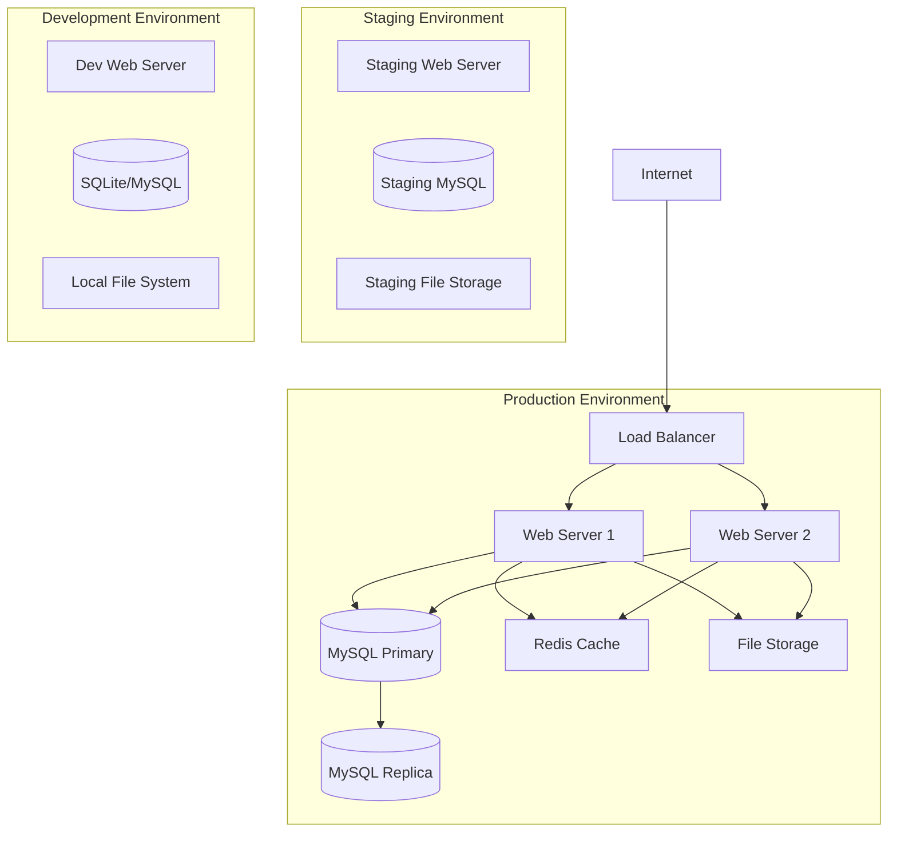

# 🚀 **Deployment Guide**

## **Document Information**
- **Project:** ChatGPT Micro-Cap Experiment - PHP Native Stock Data System
- **Version:** 1.0.0
- **Date:** September 27, 2025
- **Target Environments:** Production, Staging, Development

---

## **📋 Deployment Overview**

This guide covers the complete deployment process for the PHP-native stock data system, including server setup, configuration management, database initialization, and production optimization.

### **Deployment Architecture**



---

## **🛠️ System Requirements**

### **Minimum Production Requirements**
- **Operating System:** Ubuntu 20.04 LTS, CentOS 8+, or Windows Server 2019+
- **PHP:** 8.4 or higher with extensions: `pdo_mysql`, `pdo_sqlite`, `json`, `curl`, `mbstring`, `zip`
- **Web Server:** Apache 2.4+ or Nginx 1.18+
- **Database:** MySQL 8.0+ (primary), SQLite 3.0+ (backup/development)
- **Memory:** 2GB RAM minimum, 4GB+ recommended
- **Storage:** 10GB minimum, 50GB+ for historical data
- **Network:** Reliable internet connection for Yahoo Finance API

### **Recommended Production Specifications**
- **CPU:** 4+ cores, 2.5GHz+
- **Memory:** 8GB RAM
- **Storage:** SSD storage with 100GB+ available space
- **Network:** 100Mbps+ bandwidth
- **Backup:** Automated daily backups
- **Monitoring:** System monitoring and alerting

### **Development Environment**
- **PHP:** 8.4+ with same extensions
- **Database:** SQLite (included) or MySQL
- **Web Server:** PHP built-in server acceptable
- **Memory:** 1GB RAM minimum
- **Storage:** 5GB available space

---

## **📦 Pre-Deployment Preparation**

### **1. Source Code Preparation**

```bash
# Clone the repository
git clone https://github.com/ksfraser/ChatGPT-Micro-Cap-Experiment.git
cd ChatGPT-Micro-Cap-Experiment

# Checkout specific release tag
git checkout v1.0.0

# Verify code integrity
git verify-tag v1.0.0  # If using signed tags
```

### **2. Dependency Installation**

```bash
# Install Composer dependencies
composer install --no-dev --optimize-autoloader

# Verify installation
composer check-platform-reqs

# Generate optimized autoloader
composer dump-autoload --optimize
```

### **3. Environment Configuration**

Create environment-specific configuration files:

```bash
# Copy configuration template
cp web_ui/config.php.example web_ui/config.php

# Set appropriate permissions
chmod 600 web_ui/config.php
```

### **4. Security Preparation**

```bash
# Generate secure keys and tokens
php -r "echo bin2hex(random_bytes(32)) . \"\n\";"  # Generate secure keys

# Set file permissions
find . -type f -exec chmod 644 {} \;
find . -type d -exec chmod 755 {} \;
chmod 600 web_ui/config.php
chmod 700 web_ui/admin/
```

---

## **🌐 Server Environment Setup**

### **Ubuntu/Debian Setup**

#### **1. System Updates**
```bash
# Update system packages
sudo apt update && sudo apt upgrade -y

# Install essential packages
sudo apt install -y curl wget git unzip software-properties-common
```

#### **2. PHP Installation**
```bash
# Add PHP repository
sudo add-apt-repository ppa:ondrej/php -y
sudo apt update

# Install PHP 8.4 and required extensions
sudo apt install -y php8.4 php8.4-cli php8.4-fpm php8.4-mysql php8.4-sqlite3 \
                    php8.4-json php8.4-curl php8.4-mbstring php8.4-zip \
                    php8.4-xml php8.4-gd php8.4-opcache

# Verify installation
php --version
php -m | grep -E "(pdo_mysql|pdo_sqlite|json|curl|mbstring)"
```

#### **3. Web Server Setup (Nginx)**
```bash
# Install Nginx
sudo apt install -y nginx

# Create virtual host configuration
sudo tee /etc/nginx/sites-available/stock-data-system << 'EOF'
server {
    listen 80;
    server_name your-domain.com;
    root /var/www/stock-data-system/web_ui;
    index index.php index.html;

    # Security headers
    add_header X-Frame-Options "SAMEORIGIN" always;
    add_header X-XSS-Protection "1; mode=block" always;
    add_header X-Content-Type-Options "nosniff" always;

    # Main application
    location / {
        try_files $uri $uri/ /index.php?$query_string;
    }

    # PHP processing
    location ~ \.php$ {
        fastcgi_pass unix:/var/run/php/php8.4-fpm.sock;
        fastcgi_index index.php;
        fastcgi_param SCRIPT_FILENAME $document_root$fastcgi_script_name;
        include fastcgi_params;
    }

    # Progressive loader admin
    location ^~ /admin/ {
        # Add authentication here if needed
        try_files $uri $uri/ /admin/index.php?$query_string;
    }

    # Deny access to sensitive files
    location ~ /\.ht {
        deny all;
    }
    
    location ~ /config\.php$ {
        deny all;
    }
    
    location ~ /composer\.(json|lock)$ {
        deny all;
    }

    # Static assets caching
    location ~* \.(js|css|png|jpg|jpeg|gif|ico|svg)$ {
        expires 1y;
        add_header Cache-Control "public, immutable";
    }
}
EOF

# Enable site
sudo ln -s /etc/nginx/sites-available/stock-data-system /etc/nginx/sites-enabled/
sudo nginx -t
sudo systemctl reload nginx
```

#### **4. Web Server Setup (Apache)**
```bash
# Install Apache
sudo apt install -y apache2

# Enable required modules
sudo a2enmod rewrite ssl headers

# Create virtual host
sudo tee /etc/apache2/sites-available/stock-data-system.conf << 'EOF'
<VirtualHost *:80>
    ServerName your-domain.com
    DocumentRoot /var/www/stock-data-system/web_ui
    
    <Directory /var/www/stock-data-system/web_ui>
        AllowOverride All
        Require all granted
    </Directory>
    
    # Security headers
    Header always set X-Frame-Options "SAMEORIGIN"
    Header always set X-XSS-Protection "1; mode=block"
    Header always set X-Content-Type-Options "nosniff"
    
    # Logging
    ErrorLog ${APACHE_LOG_DIR}/stock-data-system_error.log
    CustomLog ${APACHE_LOG_DIR}/stock-data-system_access.log combined
</VirtualHost>
EOF

# Enable site
sudo a2ensite stock-data-system.conf
sudo systemctl reload apache2
```

### **CentOS/RHEL Setup**

#### **1. System Preparation**
```bash
# Update system
sudo dnf update -y

# Install EPEL repository
sudo dnf install -y epel-release

# Install Remi repository for PHP 8.4
sudo dnf install -y https://rpms.remirepo.net/enterprise/remi-release-8.rpm
sudo dnf module reset php
sudo dnf module enable php:remi-8.4
```

#### **2. PHP Installation**
```bash
# Install PHP and extensions
sudo dnf install -y php php-cli php-fpm php-mysql php-sqlite3 php-json \
                     php-curl php-mbstring php-zip php-xml php-gd php-opcache

# Start and enable PHP-FPM
sudo systemctl enable --now php-fpm
```

---

## **💾 Database Setup**

### **MySQL Production Setup**

#### **1. MySQL Installation**
```bash
# Ubuntu/Debian
sudo apt install -y mysql-server mysql-client

# CentOS/RHEL
sudo dnf install -y mysql-server mysql

# Start and enable MySQL
sudo systemctl enable --now mysql
```

#### **2. MySQL Security Configuration**
```bash
# Run security script
sudo mysql_secure_installation

# Follow prompts:
# - Set root password: YES
# - Remove anonymous users: YES
# - Disallow root login remotely: YES
# - Remove test database: YES
# - Reload privilege tables: YES
```

#### **3. Database and User Creation**
```sql
-- Connect to MySQL
mysql -u root -p

-- Create database
CREATE DATABASE stock_data_system 
CHARACTER SET utf8mb4 
COLLATE utf8mb4_unicode_ci;

-- Create application user
CREATE USER 'stock_app'@'localhost' 
IDENTIFIED BY 'secure_password_here';

-- Grant necessary privileges
GRANT SELECT, INSERT, UPDATE, DELETE, CREATE, ALTER, INDEX 
ON stock_data_system.* 
TO 'stock_app'@'localhost';

-- Create read-only user for reporting
CREATE USER 'stock_reader'@'localhost' 
IDENTIFIED BY 'readonly_password_here';

GRANT SELECT ON stock_data_system.* 
TO 'stock_reader'@'localhost';

FLUSH PRIVILEGES;
```

#### **4. MySQL Configuration Optimization**
```bash
# Edit MySQL configuration
sudo nano /etc/mysql/mysql.conf.d/mysqld.cnf

# Add optimizations
[mysqld]
# Performance tuning
innodb_buffer_pool_size = 1G
innodb_log_file_size = 256M
innodb_flush_log_at_trx_commit = 2
query_cache_size = 64M
query_cache_type = 1

# Connection settings
max_connections = 200
wait_timeout = 3600

# Binary logging for replication
log-bin = mysql-bin
server-id = 1
expire_logs_days = 7

# Restart MySQL
sudo systemctl restart mysql
```

### **SQLite Development Setup**

SQLite requires no additional setup as it's embedded in PHP. The application will automatically create the database file when needed.

```php
// Automatic SQLite database creation
$sqliteDb = new PDO('sqlite:' . __DIR__ . '/stocks.db');
```

---

## **🔧 Application Deployment**

### **1. File System Setup**

```bash
# Create application directory
sudo mkdir -p /var/www/stock-data-system
cd /var/www/stock-data-system

# Deploy application files
sudo tar -xzf stock-data-system-v1.0.0.tar.gz --strip-components=1

# Create data directories
sudo mkdir -p data/csv logs tmp
sudo mkdir -p web_ui/uploads web_ui/cache

# Set ownership
sudo chown -R www-data:www-data /var/www/stock-data-system

# Set permissions
sudo find . -type d -exec chmod 755 {} \;
sudo find . -type f -exec chmod 644 {} \;
sudo chmod 700 web_ui/admin/
sudo chmod 600 web_ui/config.php
sudo chmod 755 *.php  # Make main PHP files executable
sudo chmod 755 test_runner.php
```

### **2. Configuration Setup**

```php
<?php
// web_ui/config.php - Production configuration
return [
    // Database Configuration
    'database' => [
        'type' => 'mysql',  // or 'sqlite' for development
        'host' => 'localhost',
        'port' => 3306,
        'database' => 'stock_data_system',
        'username' => 'stock_app',
        'password' => 'secure_password_here',
        'charset' => 'utf8mb4',
        'options' => [
            PDO::ATTR_ERRMODE => PDO::ERRMODE_EXCEPTION,
            PDO::ATTR_DEFAULT_FETCH_MODE => PDO::FETCH_ASSOC,
            PDO::ATTR_EMULATE_PREPARES => false,
        ]
    ],
    
    // Yahoo Finance API Configuration
    'yahoo_finance' => [
        'timeout' => 30,
        'verify_ssl' => true,  // Set to false only for development
        'rate_limit_delay' => 2,  // seconds between requests
        'max_retries' => 3
    ],
    
    // File Storage Configuration
    'storage' => [
        'csv_directory' => __DIR__ . '/../data/csv',
        'log_directory' => __DIR__ . '/../logs',
        'temp_directory' => __DIR__ . '/../tmp',
        'max_file_size' => 100 * 1024 * 1024,  // 100MB
    ],
    
    // Security Configuration
    'security' => [
        'session_timeout' => 3600,  // 1 hour
        'password_hash_algo' => PASSWORD_ARGON2ID,
        'csrf_token_name' => '_token',
        'admin_ip_whitelist' => [],  // Empty array allows all IPs
    ],
    
    // Application Configuration
    'app' => [
        'environment' => 'production',  // production, staging, development
        'debug' => false,
        'timezone' => 'America/New_York',
        'log_level' => 'ERROR',  // DEBUG, INFO, WARNING, ERROR
    ],
    
    // Performance Configuration
    'performance' => [
        'enable_opcache' => true,
        'enable_compression' => true,
        'cache_ttl' => 3600,
    ]
];
?>
```

### **3. Database Schema Deployment**

```bash
# Run database migrations/setup
php web_ui/setup_database.php

# Or manually create tables (if setup script doesn't exist)
mysql -u stock_app -p stock_data_system < database/schema.sql
```

### **4. Initial Data Population**

```bash
# Test system connectivity
php YahooFinancePhp.php AAPL 2023-01-01 2023-01-03 --save-csv

# Initialize with sample data (optional)
php StockDataService.php AAPL 2023-01-01 2023-12-31 --save-csv

# Verify system functionality
php test_runner.php unit
```

---

## **🔒 Security Configuration**

### **1. SSL/TLS Setup**

#### **Let's Encrypt (Recommended)**
```bash
# Install Certbot
sudo apt install -y certbot python3-certbot-nginx

# Obtain SSL certificate
sudo certbot --nginx -d your-domain.com

# Verify auto-renewal
sudo certbot renew --dry-run
```

#### **Manual SSL Certificate**
```bash
# Generate self-signed certificate (development only)
sudo openssl req -x509 -nodes -days 365 -newkey rsa:2048 \
    -keyout /etc/ssl/private/stock-data-system.key \
    -out /etc/ssl/certs/stock-data-system.crt

# Update Nginx configuration for HTTPS
sudo nano /etc/nginx/sites-available/stock-data-system
```

### **2. Firewall Configuration**

```bash
# Configure UFW (Ubuntu)
sudo ufw enable
sudo ufw allow ssh
sudo ufw allow 'Nginx Full'  # or 'Apache Full'
sudo ufw allow 3306  # MySQL (only from application servers)

# Verify rules
sudo ufw status
```

### **3. Application Security**

```php
// web_ui/security.php - Security helper functions
<?php
class SecurityManager {
    public static function validateInput($input, $type = 'string') {
        switch ($type) {
            case 'symbol':
                return preg_match('/^[A-Z]{1,5}$/', $input) ? $input : false;
            case 'date':
                return DateTime::createFromFormat('Y-m-d', $input) ? $input : false;
            case 'email':
                return filter_var($input, FILTER_VALIDATE_EMAIL);
            default:
                return htmlspecialchars(strip_tags($input));
        }
    }
    
    public static function generateCSRFToken() {
        return bin2hex(random_bytes(32));
    }
    
    public static function validateCSRFToken($token, $sessionToken) {
        return hash_equals($sessionToken, $token);
    }
}
?>
```

---

## **📊 Monitoring and Logging**

### **1. Application Logging**

```php
// Create logging configuration
<?php
// logs/logger_config.php
class Logger {
    private static $logFile;
    
    public static function init($logLevel = 'ERROR') {
        self::$logFile = __DIR__ . '/application.log';
        
        // Rotate logs if they get too large
        if (file_exists(self::$logFile) && filesize(self::$logFile) > 50 * 1024 * 1024) {
            rename(self::$logFile, self::$logFile . '.' . date('Y-m-d-H-i-s'));
        }
    }
    
    public static function log($level, $message, $context = []) {
        $timestamp = date('Y-m-d H:i:s');
        $contextStr = empty($context) ? '' : ' ' . json_encode($context);
        $logEntry = "[{$timestamp}] {$level}: {$message}{$contextStr}" . PHP_EOL;
        
        file_put_contents(self::$logFile, $logEntry, FILE_APPEND | LOCK_EX);
    }
    
    public static function error($message, $context = []) {
        self::log('ERROR', $message, $context);
    }
    
    public static function warning($message, $context = []) {
        self::log('WARNING', $message, $context);
    }
    
    public static function info($message, $context = []) {
        self::log('INFO', $message, $context);
    }
}
?>
```

### **2. System Monitoring**

```bash
# Create monitoring script
#!/bin/bash
# /usr/local/bin/stock-system-monitor.sh

LOG_FILE="/var/log/stock-system-monitor.log"
WEB_DIR="/var/www/stock-data-system"

# Check web server status
if ! systemctl is-active --quiet nginx; then
    echo "$(date): Nginx is down" >> $LOG_FILE
    systemctl restart nginx
fi

# Check PHP-FPM status
if ! systemctl is-active --quiet php8.4-fpm; then
    echo "$(date): PHP-FPM is down" >> $LOG_FILE
    systemctl restart php8.4-fpm
fi

# Check MySQL status
if ! systemctl is-active --quiet mysql; then
    echo "$(date): MySQL is down" >> $LOG_FILE
    systemctl restart mysql
fi

# Check disk space
DISK_USAGE=$(df /var/www | tail -1 | awk '{print $5}' | sed 's/%//')
if [ $DISK_USAGE -gt 80 ]; then
    echo "$(date): Disk usage is ${DISK_USAGE}%" >> $LOG_FILE
fi

# Check application log for errors
ERROR_COUNT=$(tail -100 ${WEB_DIR}/logs/application.log | grep -c "ERROR")
if [ $ERROR_COUNT -gt 5 ]; then
    echo "$(date): High error rate detected: ${ERROR_COUNT} errors" >> $LOG_FILE
fi

# Make executable
chmod +x /usr/local/bin/stock-system-monitor.sh

# Add to crontab
crontab -e
# Add: */5 * * * * /usr/local/bin/stock-system-monitor.sh
```

### **3. Log Rotation**

```bash
# Create logrotate configuration
sudo tee /etc/logrotate.d/stock-data-system << 'EOF'
/var/www/stock-data-system/logs/*.log {
    daily
    rotate 30
    compress
    delaycompress
    missingok
    notifempty
    create 644 www-data www-data
    postrotate
        systemctl reload php8.4-fpm
    endscript
}
EOF
```

---

## **🚀 Performance Optimization**

### **1. PHP Optimization**

```ini
; /etc/php/8.4/fpm/php.ini - Production optimizations
[PHP]
; Memory and execution limits
memory_limit = 512M
max_execution_time = 300
max_input_time = 300

; OPcache configuration
opcache.enable=1
opcache.enable_cli=1
opcache.memory_consumption=256
opcache.interned_strings_buffer=16
opcache.max_accelerated_files=7963
opcache.validate_timestamps=0
opcache.revalidate_freq=0
opcache.save_comments=0

; Session configuration
session.cache_limiter = nocache
session.gc_maxlifetime = 3600
session.use_strict_mode = 1
session.cookie_secure = 1
session.cookie_httponly = 1
session.cookie_samesite = "Strict"

; File upload limits
upload_max_filesize = 10M
post_max_size = 10M

; Error reporting (production)
display_errors = Off
log_errors = On
error_log = /var/www/stock-data-system/logs/php_errors.log
```

### **2. Database Optimization**

```sql
-- Create indexes for optimal performance
CREATE INDEX idx_stock_symbol ON stock_prices(symbol);
CREATE INDEX idx_stock_date ON stock_prices(date);
CREATE INDEX idx_stock_symbol_date ON stock_prices(symbol, date);

-- Analyze tables regularly
ANALYZE TABLE stock_prices;
ANALYZE TABLE user_sessions;

-- Optimize tables monthly
OPTIMIZE TABLE stock_prices;
```

### **3. Web Server Optimization**

#### **Nginx Optimization**
```nginx
# /etc/nginx/nginx.conf optimizations
worker_processes auto;
worker_connections 1024;

# Gzip compression
gzip on;
gzip_vary on;
gzip_min_length 1024;
gzip_types text/plain text/css application/json application/javascript text/xml application/xml text/javascript;

# Caching
open_file_cache max=1000 inactive=20s;
open_file_cache_valid 30s;
open_file_cache_min_uses 2;
open_file_cache_errors on;
```

---

## **🔄 Backup and Recovery**

### **1. Database Backup Strategy**

```bash
#!/bin/bash
# /usr/local/bin/backup-database.sh

BACKUP_DIR="/var/backups/stock-data-system"
DATE=$(date +%Y%m%d_%H%M%S)
MYSQL_USER="stock_app"
MYSQL_PASSWORD="secure_password_here"
DATABASE="stock_data_system"

# Create backup directory
mkdir -p $BACKUP_DIR

# Database backup
mysqldump -u $MYSQL_USER -p$MYSQL_PASSWORD \
    --single-transaction \
    --routines \
    --triggers \
    $DATABASE > $BACKUP_DIR/database_backup_$DATE.sql

# Compress backup
gzip $BACKUP_DIR/database_backup_$DATE.sql

# Remove backups older than 30 days
find $BACKUP_DIR -name "database_backup_*.sql.gz" -mtime +30 -delete

# Log backup completion
echo "$(date): Database backup completed: database_backup_$DATE.sql.gz" >> /var/log/backup.log
```

### **2. File System Backup**

```bash
#!/bin/bash
# /usr/local/bin/backup-files.sh

BACKUP_DIR="/var/backups/stock-data-system"
WEB_DIR="/var/www/stock-data-system"
DATE=$(date +%Y%m%d_%H%M%S)

# Create backup directory
mkdir -p $BACKUP_DIR

# Backup application files (excluding logs and temporary files)
tar -czf $BACKUP_DIR/files_backup_$DATE.tar.gz \
    --exclude='logs/*' \
    --exclude='tmp/*' \
    --exclude='web_ui/cache/*' \
    -C /var/www stock-data-system

# Remove old file backups (keep 7 days)
find $BACKUP_DIR -name "files_backup_*.tar.gz" -mtime +7 -delete

echo "$(date): File backup completed: files_backup_$DATE.tar.gz" >> /var/log/backup.log
```

### **3. Automated Backup Schedule**

```bash
# Add to crontab
crontab -e

# Daily database backup at 2 AM
0 2 * * * /usr/local/bin/backup-database.sh

# Weekly file backup on Sunday at 3 AM
0 3 * * 0 /usr/local/bin/backup-files.sh

# Monthly full system backup
0 4 1 * * /usr/local/bin/full-system-backup.sh
```

---

## **📋 Deployment Checklist**

### **Pre-Deployment**
- [ ] Server provisioned and configured
- [ ] PHP 8.4+ installed with required extensions
- [ ] Web server (Nginx/Apache) configured
- [ ] MySQL database set up with users and permissions
- [ ] SSL certificates installed and configured
- [ ] Firewall rules configured
- [ ] DNS records configured

### **Deployment**
- [ ] Application files deployed to correct directory
- [ ] File permissions set correctly
- [ ] Configuration files updated for environment
- [ ] Database schema deployed
- [ ] Composer dependencies installed
- [ ] Initial data loaded (if required)

### **Post-Deployment**
- [ ] Application functionality tested
- [ ] Unit tests passing
- [ ] Integration tests passing
- [ ] SSL/HTTPS working correctly
- [ ] Database connections verified
- [ ] Yahoo Finance API connectivity tested
- [ ] CSV generation working
- [ ] Progressive loader accessible (admin)
- [ ] Monitoring and logging active
- [ ] Backup procedures tested
- [ ] Performance benchmarks met

### **Go-Live**
- [ ] Final smoke tests completed
- [ ] Monitoring alerts configured
- [ ] Support team notified
- [ ] Documentation updated
- [ ] Users trained (if applicable)
- [ ] Rollback plan prepared

---

## **🔧 Troubleshooting Guide**

### **Common Issues**

#### **1. Yahoo Finance API Connection Errors**
```bash
# Test API connectivity
curl -I "https://query1.finance.yahoo.com/v8/finance/chart/AAPL"

# Check DNS resolution
nslookup query1.finance.yahoo.com

# Test from PHP
php -r "
$context = stream_context_create(['http' => ['timeout' => 30]]);
$result = file_get_contents('https://finance.yahoo.com/', false, $context);
echo $result ? 'Connection OK' : 'Connection Failed';
"
```

**Solution:**
- Verify internet connectivity
- Check firewall rules for outbound HTTPS (port 443)
- Verify Yahoo Finance API is operational
- Check proxy settings if applicable

#### **2. Database Connection Issues**
```bash
# Test MySQL connection
mysql -u stock_app -p -h localhost stock_data_system

# Check MySQL service status
systemctl status mysql

# Verify PHP MySQL extension
php -m | grep pdo_mysql
```

**Solutions:**
- Verify MySQL service is running
- Check database credentials in config.php
- Verify user permissions
- Check firewall rules for MySQL port (3306)

#### **3. File Permission Errors**
```bash
# Check current permissions
ls -la /var/www/stock-data-system/

# Fix common permission issues
sudo chown -R www-data:www-data /var/www/stock-data-system/
sudo chmod -R 755 /var/www/stock-data-system/
sudo chmod 644 /var/www/stock-data-system/web_ui/config.php
```

#### **4. PHP Memory or Timeout Issues**
```bash
# Check current PHP configuration
php -i | grep -E "(memory_limit|max_execution_time)"

# Monitor memory usage during operation
php -r "
echo 'Memory limit: ' . ini_get('memory_limit') . '\n';
echo 'Current usage: ' . memory_get_usage(true) / 1024 / 1024 . 'MB\n';
"
```

**Solutions:**
- Increase memory_limit in php.ini
- Increase max_execution_time for large data operations
- Optimize code for memory efficiency
- Consider chunking large operations

#### **5. CSV Generation Failures**
```bash
# Check directory permissions
ls -la /var/www/stock-data-system/data/

# Test CSV generation manually
php YahooFinancePhp.php AAPL 2023-01-01 2023-01-03 --save-csv

# Check disk space
df -h /var/www/
```

### **Performance Issues**

#### **Slow Database Queries**
```sql
-- Enable MySQL slow query log
SET GLOBAL slow_query_log = 'ON';
SET GLOBAL long_query_time = 2;

-- Analyze slow queries
SHOW PROCESSLIST;
EXPLAIN SELECT * FROM stock_prices WHERE symbol = 'AAPL';
```

#### **High Memory Usage**
```bash
# Monitor PHP-FPM processes
ps aux | grep php-fpm

# Check memory usage per process
cat /proc/$(pgrep php-fpm)/status | grep VmRSS
```

### **Security Issues**

#### **Failed Login Attempts**
```bash
# Check authentication logs
tail -f /var/www/stock-data-system/logs/application.log | grep "authentication"

# Check web server access logs
tail -f /var/log/nginx/access.log | grep "admin"
```

---

## **📊 Maintenance Procedures**

### **Daily Tasks**
- Monitor system resource usage
- Check application logs for errors
- Verify backup completion
- Monitor Yahoo Finance API rate limits

### **Weekly Tasks**
- Review security logs
- Update system packages (security updates)
- Analyze database performance
- Clean up old log files

### **Monthly Tasks**
- Full system backup verification
- Performance optimization review
- Security assessment
- Update PHP/MySQL if needed

### **Quarterly Tasks**
- Disaster recovery testing
- Security penetration testing
- Capacity planning review
- Documentation updates

---

## **📞 Support and Escalation**

### **Emergency Contacts**
- **System Administrator:** [contact information]
- **Database Administrator:** [contact information]  
- **Security Team:** [contact information]
- **Development Team:** [contact information]

### **Escalation Procedures**
1. **Level 1:** Application errors, minor performance issues
2. **Level 2:** Database issues, API failures
3. **Level 3:** Security incidents, system outages
4. **Level 4:** Data loss, major security breaches

### **Documentation Resources**
- **API Documentation:** `/docs/API_Documentation.md`
- **Architecture Guide:** `/docs/Architecture_Documentation.md`
- **Technical Requirements:** `/docs/Technical_Requirements.md`
- **Test Documentation:** `/tests/README.md`

---

*Last Updated: September 27, 2025*  
*Version: 1.0.0*  
*Environment: Production-ready deployment guide*