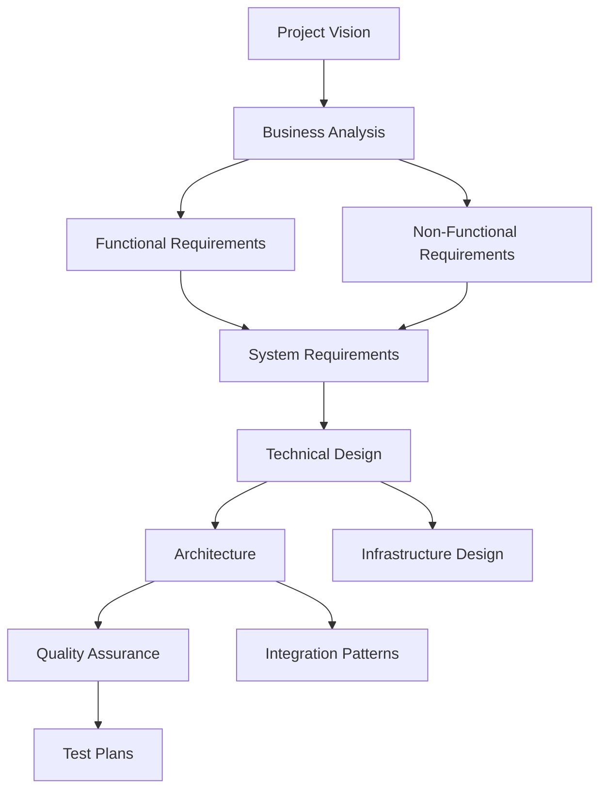

# 📋 **Project Management Documentation**

This directory contains comprehensive project management documentation organized by functional areas for easy access by Product Managers, Business Analysts, QA teams, and other stakeholders.

---

## 📂 **Directory Structure**

### 📊 **[Requirements](requirements/)**
Documentation defining what the system should do and how it should perform.

- **[requirements.md](requirements/requirements.md)** - Complete functional and technical requirements with acceptance criteria
- **[FUNCTIONAL_REQUIREMENTS.md](requirements/FUNCTIONAL_REQUIREMENTS.md)** - Detailed functional specifications
- **[NON_FUNCTIONAL_REQUIREMENTS.md](requirements/NON_FUNCTIONAL_REQUIREMENTS.md)** - Performance, security, and operational requirements
- **[System_Requirements.md](requirements/System_Requirements.md)** - Technical system specifications

### 🧪 **[Quality Assurance](quality_assurance/)**
Testing standards, QA procedures, and quality control documentation.

- **[Quality_Assurance.md](quality_assurance/Quality_Assurance.md)** - Comprehensive QA framework, testing procedures, and quality metrics
- **[QA_DOCUMENT.md](quality_assurance/QA_DOCUMENT.md)** - QA processes and standards
- **[test_plan.md](quality_assurance/test_plan.md)** - Detailed test planning and execution procedures

### 💼 **[Business Analysis](business_analysis/)**
Market analysis, competitive positioning, and business strategy documentation.

- **[Business_Analysis.md](business_analysis/Business_Analysis.md)** - Complete market analysis, competitive positioning, and revenue projections
- **[Project_Vision.md](business_analysis/Project_Vision.md)** - Project vision and strategic objectives

### 🏛️ **[Architecture](architecture/)**
System architecture, design patterns, and integration documentation.

- **[ARCHITECTURE.md](architecture/ARCHITECTURE.md)** - High-level system architecture overview
- **[Platform_Architecture.md](architecture/Platform_Architecture.md)** - Detailed platform architecture specifications
- **[Class_Integration_Patterns.md](architecture/Class_Integration_Patterns.md)** - Cross-system integration patterns and data flows

### 🎨 **[Design](design/)**
Technical design specifications and infrastructure documentation.

- **[Technical_Design.md](design/Technical_Design.md)** - Detailed technical design specifications
- **[infrastructure.md](design/infrastructure.md)** - Infrastructure setup and configuration

---

## 🎯 **Quick Navigation by Role**

### **Product Managers**
- Start with: [Project Vision](business_analysis/Project_Vision.md) → [Business Analysis](business_analysis/Business_Analysis.md) → [Requirements](requirements/requirements.md)
- Key Focus: Market opportunity, competitive analysis, feature requirements

### **Business Analysts** 
- Start with: [Functional Requirements](requirements/FUNCTIONAL_REQUIREMENTS.md) → [Business Analysis](business_analysis/Business_Analysis.md) → [System Requirements](requirements/System_Requirements.md)
- Key Focus: Requirements definition, business process mapping, acceptance criteria

### **QA Teams**
- Start with: [Quality Assurance Framework](quality_assurance/Quality_Assurance.md) → [Test Plan](quality_assurance/test_plan.md) → [QA Document](quality_assurance/QA_DOCUMENT.md)
- Key Focus: Testing standards, quality metrics, test procedures

### **Solution Architects**
- Start with: [System Architecture](architecture/ARCHITECTURE.md) → [Platform Architecture](architecture/Platform_Architecture.md) → [Technical Design](design/Technical_Design.md)
- Key Focus: Architecture patterns, integration design, technical specifications

### **Development Teams**
- Start with: [Technical Design](design/Technical_Design.md) → [Architecture](architecture/ARCHITECTURE.md) → [Requirements](requirements/requirements.md)
- Key Focus: Implementation guidelines, technical requirements, architecture patterns

---

## 📈 **Document Relationships**

---

## 📊 **Documentation Maturity**

| Document Category | Status | Last Updated | Next Review |
|------------------|--------|--------------|-------------|
| Requirements | ✅ Complete | Sep 2025 | Dec 2025 |
| Business Analysis | ✅ Complete | Sep 2025 | Dec 2025 |
| Architecture | ✅ Complete | Sep 2025 | Oct 2025 |
| Quality Assurance | ✅ Complete | Sep 2025 | Nov 2025 |
| Technical Design | ✅ Complete | Sep 2025 | Oct 2025 |

---

## 📞 **Document Ownership**

| Category | Primary Owner | Secondary Contact |
|----------|---------------|-------------------|
| Requirements | Product Manager | Business Analyst |
| Business Analysis | Business Analyst | Product Manager |
| Architecture | Solution Architect | Lead Developer |
| Quality Assurance | QA Manager | QA Lead |
| Technical Design | Lead Developer | Solution Architect |

---

## 🔄 **Change Management**

### **Document Update Process**
1. **Identify Changes:** Stakeholder identifies need for documentation update
2. **Impact Assessment:** Evaluate impact on related documents and systems
3. **Review and Approval:** Get approval from document owner and affected stakeholders
4. **Update Documentation:** Make changes and update version control
5. **Communication:** Notify all stakeholders of changes and new versions

### **Version Control**
- All documents are version controlled in Git
- Major changes require pull request review
- Breaking changes require stakeholder sign-off
- Document history preserved for audit purposes

---

**📝 Document Version:** 1.0  
**📅 Last Updated:** September 26, 2025  
**👤 Document Owner:** Project Management Office  
**📧 Contact:** nathanbsmith.business@gmail.com