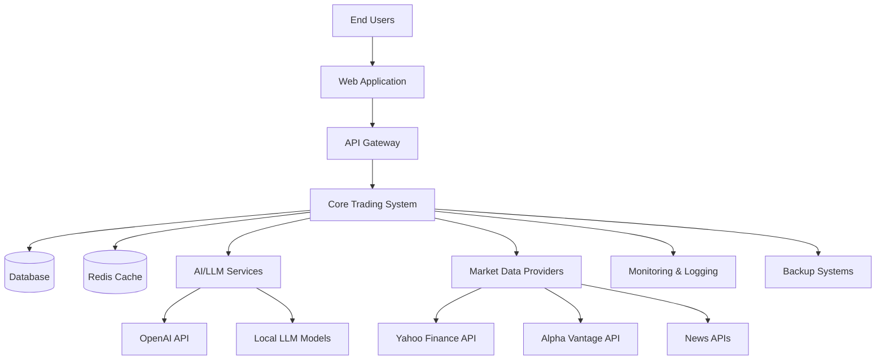
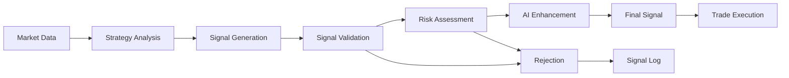
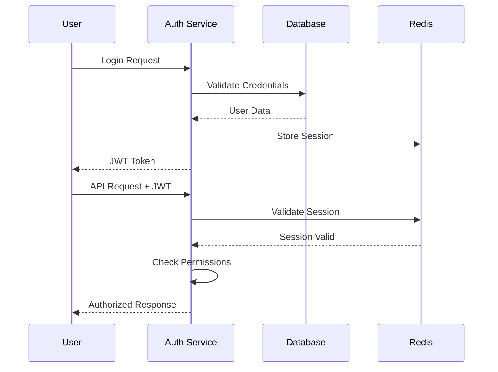
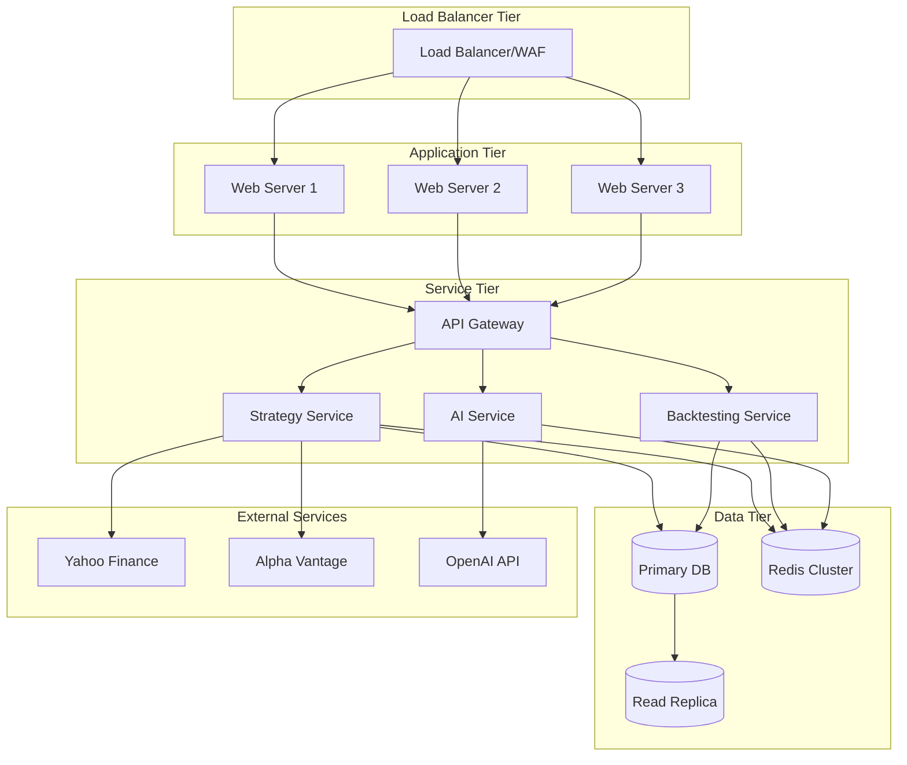
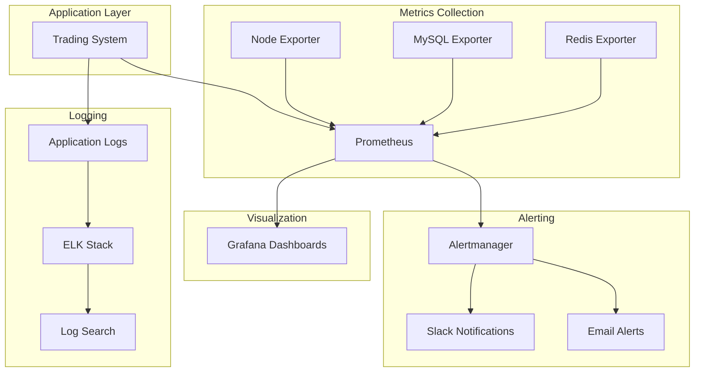
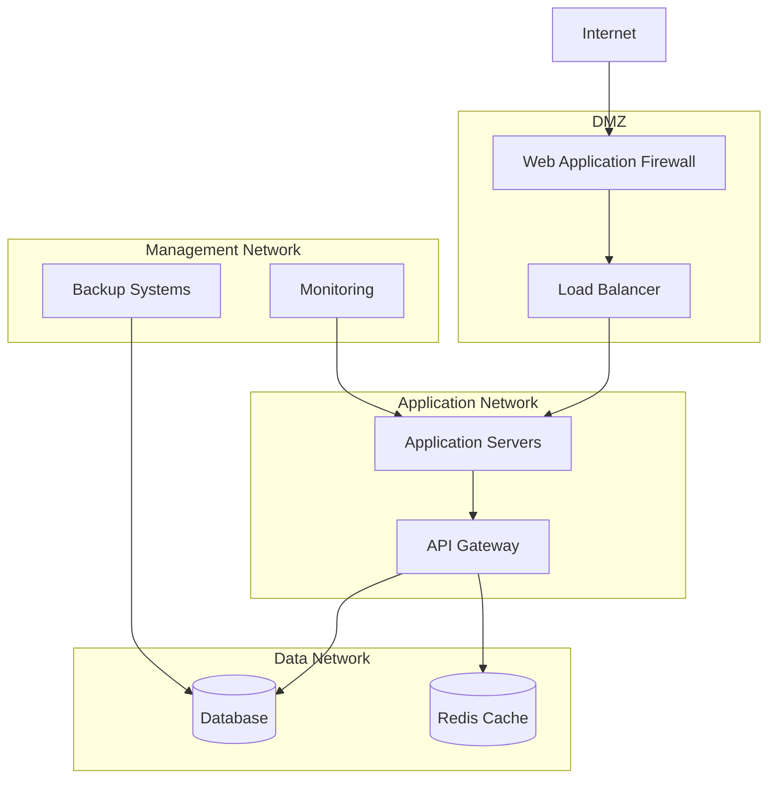

# System Architecture Document
## ChatGPT Micro-Cap Trading System v2.0

**Document Version:** 2.0  
**Date:** September 17, 2025  
**Author:** Architecture Team  
**Architecture ID:** AD-CMCTS-2.0

---

## 1. Executive Summary

### 1.1 System Overview
The ChatGPT Micro-Cap Trading System v2.0 is a comprehensive algorithmic trading platform that integrates artificial intelligence for market analysis with advanced backtesting capabilities. The system is designed to manage multiple trading strategies, execute paper trading, and provide detailed performance analytics for micro-cap securities.

### 1.2 Business Context
- **Primary Purpose:** Automated trading strategy development and backtesting for micro-cap stocks
- **Target Users:** Quantitative traders, portfolio managers, and research analysts
- **Business Value:** Reduced manual analysis time, systematic strategy validation, AI-enhanced decision making

### 1.3 Key Architectural Principles
- **Modularity:** Loosely coupled components with clear interfaces
- **Scalability:** Horizontal scaling capability for processing multiple strategies
- **Reliability:** Fault-tolerant design with graceful degradation
- **Security:** Multi-layered security with role-based access control
- **Maintainability:** Clean code architecture with comprehensive testing

---

## 2. System Context and Scope

### 2.1 System Boundary



### 2.2 External Dependencies

#### Market Data Providers
- **Yahoo Finance API:** Primary source for OHLCV data
- **Alpha Vantage API:** Secondary data source and fundamental data
- **News APIs:** Financial news and sentiment data

#### AI/LLM Services
- **OpenAI API:** GPT-4 for market analysis and strategy evaluation
- **Local Models:** Fallback AI processing capabilities

#### Infrastructure Services
- **Database:** MySQL for persistent data storage
- **Cache:** Redis for high-performance data access
- **Monitoring:** Prometheus/Grafana for system monitoring
- **Logging:** Centralized logging with ELK stack

### 2.3 User Categories

#### Primary Users
- **Traders:** Strategy configuration and monitoring
- **Analysts:** Performance analysis and reporting
- **Administrators:** System configuration and user management

#### Secondary Users
- **Portfolio Managers:** High-level performance oversight
- **Compliance Officers:** Audit trail and regulatory reporting
- **System Operators:** Infrastructure monitoring and maintenance

---

## 3. High-Level Architecture

### 3.1 Architectural Overview

The system follows a **layered architecture** pattern with **domain-driven design** principles:

```
┌─────────────────────────────────────────────────────────────┐
│                    Presentation Layer                       │
│  ┌─────────────┐  ┌─────────────┐  ┌─────────────────────┐ │
│  │ Web Dashboard│  │   REST API  │  │    CLI Tools        │ │
│  └─────────────┘  └─────────────┘  └─────────────────────┘ │
└─────────────────────────────────────────────────────────────┘
┌─────────────────────────────────────────────────────────────┐
│                    Application Layer                        │
│  ┌─────────────┐  ┌─────────────┐  ┌─────────────────────┐ │
│  │Strategy Mgmt│  │ Backtesting │  │    Portfolio Mgmt   │ │
│  └─────────────┘  └─────────────┘  └─────────────────────┘ │
└─────────────────────────────────────────────────────────────┘
┌─────────────────────────────────────────────────────────────┐
│                      Domain Layer                           │
│  ┌─────────────┐  ┌─────────────┐  ┌─────────────────────┐ │
│  │ Strategies  │  │ Market Data │  │     Analytics       │ │
│  └─────────────┘  └─────────────┘  └─────────────────────┘ │
└─────────────────────────────────────────────────────────────┘
┌─────────────────────────────────────────────────────────────┐
│                  Infrastructure Layer                       │
│  ┌─────────────┐  ┌─────────────┐  ┌─────────────────────┐ │
│  │  Database   │  │   Cache     │  │   External APIs     │ │
│  └─────────────┘  └─────────────┘  └─────────────────────┘ │
└─────────────────────────────────────────────────────────────┘
```

### 3.2 Core Components

#### 3.2.1 Strategy Management System

**Purpose:** Manage trading strategy lifecycle from creation to execution

**Key Responsibilities:**
- Strategy configuration and parameterization
- Signal generation and validation
- Strategy performance tracking
- AI-enhanced strategy analysis

**Architecture Pattern:** Strategy Pattern with Factory Pattern

```php
namespace Ksfraser\Finance\Strategy;

interface StrategyInterface {
    public function generateSignal(array $marketData): ?Signal;
    public function getParameters(): array;
    public function validateParameters(array $params): bool;
}

class StrategyFactory {
    public function createStrategy(string $type, array $params): StrategyInterface;
}
```

#### 3.2.2 Backtesting Engine

**Purpose:** Historical strategy performance simulation and analysis

**Key Responsibilities:**
- Trade execution simulation with realistic costs
- Performance metrics calculation
- Risk analysis and drawdown tracking
- Comparative strategy analysis

**Architecture Pattern:** Command Pattern with Observer Pattern

```php
namespace Ksfraser\Finance\Backtesting;

class BacktestingEngine {
    private EventDispatcher $eventDispatcher;
    private PerformanceAnalyzer $analyzer;
    private TradeSimulator $simulator;
    
    public function runBacktest(Strategy $strategy, array $data): BacktestResult;
}
```

#### 3.2.3 AI Integration Layer

**Purpose:** Artificial intelligence services for market analysis and strategy enhancement

**Key Responsibilities:**
- Market sentiment analysis
- Strategy performance evaluation
- News impact assessment
- Predictive analytics

**Architecture Pattern:** Provider Pattern with Adapter Pattern

```php
namespace Ksfraser\LLM;

interface LLMProviderInterface {
    public function generateResponse(string $prompt, array $options = []): Response;
    public function analyzeFinancialContent(string $content): AnalysisResult;
}

class OpenAIProvider implements LLMProviderInterface {
    // Implementation
}
```

#### 3.2.4 Data Management System

**Purpose:** Market data acquisition, processing, and storage

**Key Responsibilities:**
- Real-time and historical data ingestion
- Data quality validation and cleansing
- Multi-source data aggregation
- Data caching and optimization

**Architecture Pattern:** Repository Pattern with Data Access Object (DAO)

```php
namespace Ksfraser\Finance\Data;

interface MarketDataRepositoryInterface {
    public function getHistoricalData(string $symbol, DateRange $range): array;
    public function getRealTimeQuote(string $symbol): Quote;
    public function getMultipleQuotes(array $symbols): array;
}
```

---

## 4. Detailed Component Architecture

### 4.1 Strategy System Architecture

#### 4.1.1 Strategy Hierarchy

```
StrategyInterface
├── TechnicalAnalysis/
│   ├── MovingAverageCrossoverStrategy
│   ├── RSIStrategy
│   ├── MACDStrategy
│   └── BollingerBandsStrategy
├── Turtle/
│   ├── TurtleStrategy
│   └── FourWeekRuleStrategy
├── SupportResistance/
│   ├── SupportResistanceStrategy
│   └── PivotPointStrategy
└── Breakout/
    ├── BreakoutStrategy
    └── VolumeBreakoutStrategy
```

#### 4.1.2 Strategy Configuration System

```php
class StrategyConfiguration {
    private string $strategyType;
    private array $parameters;
    private array $riskLimits;
    private ScheduleConfig $schedule;
    
    public function validate(): ValidationResult;
    public function toArray(): array;
    public static function fromArray(array $data): self;
}

class ParameterValidator {
    public function validateParameter(string $name, mixed $value, array $constraints): bool;
    public function getValidationErrors(): array;
}
```

#### 4.1.3 Signal Processing Pipeline



### 4.2 Backtesting Engine Architecture

#### 4.2.1 Core Backtesting Components

```php
namespace Ksfraser\Finance\Backtesting;

class BacktestingEngine {
    public function __construct(
        private TradeSimulator $simulator,
        private PerformanceAnalyzer $analyzer,
        private RiskAnalyzer $riskAnalyzer,
        private AIAnalysisService $aiService
    ) {}
    
    public function runBacktest(
        StrategyInterface $strategy,
        array $marketData,
        BacktestConfig $config
    ): BacktestResult {
        $portfolio = new Portfolio($config->getInitialCapital());
        $trades = [];
        
        foreach ($marketData as $dataPoint) {
            $signal = $strategy->generateSignal($dataPoint);
            
            if ($signal) {
                $trade = $this->simulator->executeTrade($signal, $portfolio, $config);
                if ($trade) {
                    $trades[] = $trade;
                    $portfolio->addTrade($trade);
                }
            }
        }
        
        $performance = $this->analyzer->analyze($portfolio, $trades);
        $riskMetrics = $this->riskAnalyzer->calculateRiskMetrics($portfolio);
        $aiInsights = $this->aiService->analyzeStrategy($strategy, $performance);
        
        return new BacktestResult($performance, $riskMetrics, $aiInsights, $trades);
    }
}
```

#### 4.2.2 Performance Metrics Calculator

```php
class PerformanceAnalyzer {
    public function analyze(Portfolio $portfolio, array $trades): PerformanceMetrics {
        return new PerformanceMetrics([
            'total_return' => $this->calculateTotalReturn($portfolio),
            'sharpe_ratio' => $this->calculateSharpeRatio($portfolio),
            'max_drawdown' => $this->calculateMaxDrawdown($portfolio),
            'win_rate' => $this->calculateWinRate($trades),
            'profit_factor' => $this->calculateProfitFactor($trades),
            'avg_trade_duration' => $this->calculateAvgTradeDuration($trades),
            'volatility' => $this->calculateVolatility($portfolio),
            'alpha' => $this->calculateAlpha($portfolio),
            'beta' => $this->calculateBeta($portfolio),
            'information_ratio' => $this->calculateInformationRatio($portfolio)
        ]);
    }
}
```

### 4.3 Data Layer Architecture

#### 4.3.1 Database Schema Design

**Core Tables:**
```sql
-- Strategy configurations
CREATE TABLE strategies (
    id BIGINT PRIMARY KEY AUTO_INCREMENT,
    name VARCHAR(255) NOT NULL,
    type VARCHAR(100) NOT NULL,
    parameters JSON NOT NULL,
    risk_limits JSON,
    created_at TIMESTAMP DEFAULT CURRENT_TIMESTAMP,
    updated_at TIMESTAMP DEFAULT CURRENT_TIMESTAMP ON UPDATE CURRENT_TIMESTAMP,
    
    INDEX idx_type (type),
    INDEX idx_created_at (created_at)
);

-- Market data storage
CREATE TABLE market_data (
    id BIGINT PRIMARY KEY AUTO_INCREMENT,
    symbol VARCHAR(10) NOT NULL,
    timestamp DATETIME NOT NULL,
    open DECIMAL(12,4) NOT NULL,
    high DECIMAL(12,4) NOT NULL,
    low DECIMAL(12,4) NOT NULL,
    close DECIMAL(12,4) NOT NULL,
    volume BIGINT NOT NULL,
    source VARCHAR(50) NOT NULL,
    
    UNIQUE KEY unique_symbol_timestamp (symbol, timestamp),
    INDEX idx_symbol_timestamp (symbol, timestamp),
    INDEX idx_timestamp (timestamp)
);

-- Trade execution records
CREATE TABLE trades (
    id BIGINT PRIMARY KEY AUTO_INCREMENT,
    strategy_id BIGINT NOT NULL,
    symbol VARCHAR(10) NOT NULL,
    action ENUM('BUY', 'SELL') NOT NULL,
    quantity INT NOT NULL,
    price DECIMAL(12,4) NOT NULL,
    commission DECIMAL(8,4) DEFAULT 0,
    timestamp DATETIME NOT NULL,
    signal_confidence DECIMAL(3,2),
    ai_analysis JSON,
    
    FOREIGN KEY (strategy_id) REFERENCES strategies(id),
    INDEX idx_strategy_symbol (strategy_id, symbol),
    INDEX idx_timestamp (timestamp)
);

-- Backtesting results
CREATE TABLE backtest_results (
    id BIGINT PRIMARY KEY AUTO_INCREMENT,
    strategy_id BIGINT NOT NULL,
    start_date DATE NOT NULL,
    end_date DATE NOT NULL,
    initial_capital DECIMAL(12,2) NOT NULL,
    final_value DECIMAL(12,2) NOT NULL,
    total_return DECIMAL(8,4) NOT NULL,
    sharpe_ratio DECIMAL(6,4),
    max_drawdown DECIMAL(6,4),
    win_rate DECIMAL(5,4),
    performance_metrics JSON,
    ai_insights JSON,
    created_at TIMESTAMP DEFAULT CURRENT_TIMESTAMP,
    
    FOREIGN KEY (strategy_id) REFERENCES strategies(id),
    INDEX idx_strategy_dates (strategy_id, start_date, end_date)
);
```

#### 4.3.2 Caching Strategy

**Redis Cache Structure:**
```
trading_system:
├── market_data:{symbol}:{date} -> OHLCV data (TTL: 1 hour)
├── signals:{strategy_id}:{symbol} -> Latest signals (TTL: 5 minutes)
├── portfolio:{portfolio_id} -> Portfolio state (TTL: 30 minutes)
├── performance:{strategy_id} -> Performance metrics (TTL: 1 hour)
└── ai_analysis:{content_hash} -> AI analysis results (TTL: 24 hours)
```

**Cache Implementation:**
```php
class CacheManager {
    private Redis $redis;
    
    public function getMarketData(string $symbol, string $date): ?array {
        $key = "trading_system:market_data:{$symbol}:{$date}";
        $data = $this->redis->get($key);
        return $data ? json_decode($data, true) : null;
    }
    
    public function setMarketData(string $symbol, string $date, array $data): void {
        $key = "trading_system:market_data:{$symbol}:{$date}";
        $this->redis->setex($key, 3600, json_encode($data)); // 1 hour TTL
    }
}
```

### 4.4 Security Architecture

#### 4.4.1 Authentication and Authorization

**Security Layers:**
```
┌─────────────────────────────────────────┐
│              WAF/Load Balancer          │
└─────────────────────────────────────────┘
┌─────────────────────────────────────────┐
│              Rate Limiting              │
└─────────────────────────────────────────┘
┌─────────────────────────────────────────┐
│          JWT Authentication             │
└─────────────────────────────────────────┘
┌─────────────────────────────────────────┐
│       Role-Based Access Control        │
└─────────────────────────────────────────┘
┌─────────────────────────────────────────┐
│           Input Validation              │
└─────────────────────────────────────────┘
┌─────────────────────────────────────────┐
│              Application                │
└─────────────────────────────────────────┘
```

**Authentication Flow:**


#### 4.4.2 Data Encryption and Privacy

**Encryption Standards:**
- **Data at Rest:** AES-256 encryption for sensitive database fields
- **Data in Transit:** TLS 1.3 for all external communications
- **API Keys:** Encrypted storage with key rotation capability
- **Audit Logs:** Tamper-proof logging with digital signatures

```php
class EncryptionService {
    private string $encryptionKey;
    
    public function encrypt(string $data): string {
        $cipher = 'AES-256-GCM';
        $iv = random_bytes(16);
        $tag = '';
        
        $encrypted = openssl_encrypt($data, $cipher, $this->encryptionKey, OPENSSL_RAW_DATA, $iv, $tag);
        
        return base64_encode($iv . $tag . $encrypted);
    }
    
    public function decrypt(string $encryptedData): string {
        $data = base64_decode($encryptedData);
        $cipher = 'AES-256-GCM';
        
        $iv = substr($data, 0, 16);
        $tag = substr($data, 16, 16);
        $encrypted = substr($data, 32);
        
        return openssl_decrypt($encrypted, $cipher, $this->encryptionKey, OPENSSL_RAW_DATA, $iv, $tag);
    }
}
```

### 4.5 Portfolio Analytics Architecture

#### 4.5.1 Sector Analysis & Charting System

**Purpose:** Comprehensive portfolio sector allocation analysis with benchmark comparison and risk assessment

**Architecture Overview:**

```
┌─────────────────────────────────────────────────────────────┐
│                    Presentation Layer                       │
│  ┌─────────────────────────────────────────────────────┐   │
│  │  sector_analysis.php (UI Page)                      │   │
│  │  - 3 Metric Cards (Diversification, Risk, HHI)     │   │
│  │  - Pie Chart (Sector Allocation)                   │   │
│  │  - Bar Chart (Portfolio vs S&P 500)                │   │
│  │  - Overweight/Underweight Lists                    │   │
│  └─────────────────────────────────────────────────────┘   │
│  ┌─────────────────────────────────────────────────────┐   │
│  │  chart_service.js (Charting Utilities)             │   │
│  │  - createSectorPieChart()                          │   │
│  │  - createSectorComparisonChart()                   │   │
│  │  - fetchSectorAnalysis()                           │   │
│  │  - formatMetricsTable()                            │   │
│  └─────────────────────────────────────────────────────┘   │
└─────────────────────────────────────────────────────────────┘
┌─────────────────────────────────────────────────────────────┐
│                    API Layer                                │
│  ┌─────────────────────────────────────────────────────┐   │
│  │  /api/sector-analysis.php                          │   │
│  │  GET ?user_id={id}                                 │   │
│  │  Response: JSON with all sector analysis data     │   │
│  └─────────────────────────────────────────────────────┘   │
└─────────────────────────────────────────────────────────────┘
┌─────────────────────────────────────────────────────────────┐
│                    Service Layer                            │
│  ┌─────────────────────────────────────────────────────┐   │
│  │  SectorAnalysisChartService                        │   │
│  │  - calculateSectorAllocation()                     │   │
│  │  - compareToBenchmark()                            │   │
│  │  - calculateConcentrationRisk()                    │   │
│  │  - calculateDiversificationScore()                 │   │
│  │  - formatForPieChart()                             │   │
│  │  - formatForComparisonChart()                      │   │
│  │  - validateSectorData()                            │   │
│  │  - sanitizeSectorName()                            │   │
│  │  - getPortfolioSectorAnalysis()                    │   │
│  └─────────────────────────────────────────────────────┘   │
└─────────────────────────────────────────────────────────────┘
┌─────────────────────────────────────────────────────────────┐
│                    Data Access Layer                        │
│  ┌─────────────────────────────────────────────────────┐   │
│  │  SectorAnalysisDAOImpl                             │   │
│  │  - getPortfolioSectorData(userId)                 │   │
│  │  - getSP500SectorWeights()                        │   │
│  │  - getSectorsBySymbols(symbols)                   │   │
│  │  - getDefaultSP500Weights()                       │   │
│  └─────────────────────────────────────────────────────┘   │
└─────────────────────────────────────────────────────────────┘
┌─────────────────────────────────────────────────────────────┐
│                    Database Layer                           │
│  ┌─────────────────────────────────────────────────────┐   │
│  │  portfolio_positions (user holdings)               │   │
│  │  stock_fundamentals (sector classification)       │   │
│  │  sector_performance (S&P 500 weights)             │   │
│  └─────────────────────────────────────────────────────┘   │
└─────────────────────────────────────────────────────────────┘
```

**Component Details:**

```php
namespace App\Services;

/**
 * Sector Analysis Chart Service
 * 
 * Prepares sector allocation data for visualization and analysis.
 * Implements comprehensive risk metrics and benchmark comparison.
 */
class SectorAnalysisChartService
{
    private SectorAnalysisDAO $dao;
    
    public function __construct(SectorAnalysisDAO $dao) {
        $this->dao = $dao;
    }
    
    /**
     * Calculate sector allocation percentages
     * 
     * @param int $userId User identifier
     * @return array Sector allocation data with percentages
     */
    public function calculateSectorAllocation(int $userId): array
    {
        $holdings = $this->dao->getPortfolioSectorData($userId);
        
        $totalValue = array_sum(array_column($holdings, 'value'));
        $allocation = [];
        
        foreach ($holdings as $holding) {
            $sector = $this->sanitizeSectorName($holding['sector']);
            if (!isset($allocation[$sector])) {
                $allocation[$sector] = 0;
            }
            $allocation[$sector] += $holding['value'];
        }
        
        foreach ($allocation as $sector => $value) {
            $allocation[$sector] = round(($value / $totalValue) * 100, 2);
        }
        
        return $allocation;
    }
    
    /**
     * Compare portfolio allocation to S&P 500 benchmark
     * 
     * @param array $portfolioAllocation Sector percentages
     * @return array Comparison data with overweight/underweight sectors
     */
    public function compareToBenchmark(array $portfolioAllocation): array
    {
        $benchmarkWeights = $this->dao->getSP500SectorWeights();
        
        $comparison = [];
        $overweight = [];
        $underweight = [];
        
        foreach ($portfolioAllocation as $sector => $portfolioWeight) {
            $benchmarkWeight = $benchmarkWeights[$sector] ?? 0;
            $difference = $portfolioWeight - $benchmarkWeight;
            
            $comparison[$sector] = [
                'portfolio_weight' => $portfolioWeight,
                'benchmark_weight' => $benchmarkWeight,
                'difference' => round($difference, 2)
            ];
            
            if ($difference > 5) {
                $overweight[] = ['sector' => $sector, 'difference' => round($difference, 2)];
            } elseif ($difference < -5) {
                $underweight[] = ['sector' => $sector, 'difference' => round($difference, 2)];
            }
        }
        
        return [
            'comparison' => $comparison,
            'overweight' => $overweight,
            'underweight' => $underweight
        ];
    }
    
    /**
     * Calculate concentration risk metrics
     * 
     * @param array $allocation Sector allocation percentages
     * @return array Risk metrics (HHI, top sector weight, risk level)
     */
    public function calculateConcentrationRisk(array $allocation): array
    {
        // Herfindahl-Hirschman Index
        $hhi = 0;
        foreach ($allocation as $weight) {
            $hhi += pow($weight, 2);
        }
        $hhi = round($hhi, 2);
        
        // Top sector weight
        $topSectorWeight = max($allocation);
        
        // Risk level determination
        $riskLevel = 'LOW';
        if ($hhi >= 2500 || $topSectorWeight >= 60) {
            $riskLevel = 'HIGH';
        } elseif ($hhi >= 1500 || $topSectorWeight >= 40) {
            $riskLevel = 'MEDIUM';
        }
        
        return [
            'hhi' => $hhi,
            'top_sector_weight' => round($topSectorWeight, 2),
            'risk_level' => $riskLevel
        ];
    }
    
    /**
     * Calculate diversification score (0-100)
     * 
     * Scoring algorithm:
     * - Sector count (40%): More sectors = higher score
     * - Max sector weight (35%): Lower concentration = higher score
     * - HHI (30%): Lower HHI = higher score
     * 
     * @param array $allocation Sector allocation percentages
     * @return float Score from 0-100
     */
    public function calculateDiversificationScore(array $allocation): float
    {
        $sectorCount = count($allocation);
        $maxWeight = max($allocation);
        
        $hhi = 0;
        foreach ($allocation as $weight) {
            $hhi += pow($weight, 2);
        }
        
        // Sector count score (40% weight)
        if ($sectorCount >= 9) {
            $sectorScore = 100;
        } elseif ($sectorCount >= 6) {
            $sectorScore = 70;
        } elseif ($sectorCount >= 3) {
            $sectorScore = 40;
        } else {
            $sectorScore = 10;
        }
        
        // Max weight score (35% weight)
        if ($maxWeight <= 15) {
            $maxWeightScore = 100;
        } elseif ($maxWeight <= 25) {
            $maxWeightScore = 70;
        } elseif ($maxWeight <= 40) {
            $maxWeightScore = 40;
        } else {
            $maxWeightScore = 10;
        }
        
        // HHI score (30% weight)
        if ($hhi <= 1500) {
            $hhiScore = 100;
        } elseif ($hhi <= 2000) {
            $hhiScore = 70;
        } elseif ($hhi <= 2500) {
            $hhiScore = 40;
        } else {
            $hhiScore = 10;
        }
        
        $score = ($sectorScore * 0.4) + ($maxWeightScore * 0.35) + ($hhiScore * 0.3);
        
        return round($score, 2);
    }
    
    /**
     * Format data for Chart.js pie chart
     * 
     * @param array $allocation Sector allocation percentages
     * @return array Chart.js compatible format
     */
    public function formatForPieChart(array $allocation): array
    {
        $colors = [
            '#FF6384', '#36A2EB', '#FFCE56', '#4BC0C0', '#9966FF',
            '#FF9F40', '#FF6384', '#C9CBCF', '#4BC0C0', '#FF6384', '#36A2EB'
        ];
        
        return [
            'labels' => array_keys($allocation),
            'datasets' => [[
                'data' => array_values($allocation),
                'backgroundColor' => array_slice($colors, 0, count($allocation)),
                'borderWidth' => 1
            ]]
        ];
    }
    
    /**
     * Format data for Chart.js comparison bar chart
     * 
     * @param array $comparison Sector comparison data
     * @return array Chart.js compatible format
     */
    public function formatForComparisonChart(array $comparison): array
    {
        $labels = [];
        $portfolioData = [];
        $benchmarkData = [];
        
        foreach ($comparison as $sector => $data) {
            $labels[] = $sector;
            $portfolioData[] = $data['portfolio_weight'];
            $benchmarkData[] = $data['benchmark_weight'];
        }
        
        return [
            'labels' => $labels,
            'datasets' => [
                [
                    'label' => 'Portfolio',
                    'data' => $portfolioData,
                    'backgroundColor' => 'rgba(54, 162, 235, 0.8)',
                    'borderColor' => 'rgba(54, 162, 235, 1)',
                    'borderWidth' => 1
                ],
                [
                    'label' => 'S&P 500',
                    'data' => $benchmarkData,
                    'backgroundColor' => 'rgba(201, 203, 207, 0.8)',
                    'borderColor' => 'rgba(201, 203, 207, 1)',
                    'borderWidth' => 1
                ]
            ]
        ];
    }
}
```

**Database Schema:**

```sql
-- Portfolio positions with sector classification
CREATE TABLE portfolio_positions (
    id INT AUTO_INCREMENT PRIMARY KEY,
    user_id INT NOT NULL,
    symbol VARCHAR(10) NOT NULL,
    quantity DECIMAL(15, 6) NOT NULL,
    purchase_price DECIMAL(15, 2) NOT NULL,
    current_price DECIMAL(15, 2),
    sector VARCHAR(50),
    INDEX idx_user_symbol (user_id, symbol),
    INDEX idx_sector (sector)
);

-- Stock fundamentals with GICS sector classification
CREATE TABLE stock_fundamentals (
    id INT AUTO_INCREMENT PRIMARY KEY,
    symbol VARCHAR(10) NOT NULL UNIQUE,
    company_name VARCHAR(255),
    sector VARCHAR(50),
    industry VARCHAR(100),
    market_cap BIGINT,
    updated_at TIMESTAMP DEFAULT CURRENT_TIMESTAMP,
    INDEX idx_sector (sector)
);

-- S&P 500 sector weights (benchmark)
CREATE TABLE sector_performance (
    id INT AUTO_INCREMENT PRIMARY KEY,
    sector VARCHAR(50) NOT NULL,
    weight_percentage DECIMAL(5, 2) NOT NULL,
    as_of_date DATE NOT NULL,
    INDEX idx_sector_date (sector, as_of_date)
);
```

**Test Coverage:**

```php
// tests/Services/SectorAnalysisChartServiceTest.php
class SectorAnalysisChartServiceTest extends TestCase
{
    private SectorAnalysisChartService $service;
    private SectorAnalysisDAO $mockDAO;
    
    // 11 test methods, all passing:
    // - testCalculateSectorAllocation()
    // - testCompareToBenchmark()
    // - testIdentifyOverweightUnderweight()
    // - testCalculateConcentrationRisk()
    // - testDiversificationScore()
    // - testFormatForPieChart()
    // - testFormatForComparisonChart()
    // - testValidateSectorData()
    // - testSanitizeSectorName()
    // - testGetPortfolioSectorAnalysis()
    // - testHandleInvalidUserId()
}
```

#### 4.5.2 Index Benchmarking System

**Purpose:** Comprehensive performance comparison against major market indexes with statistical analysis and risk metrics

**Architecture Overview:**

```
┌─────────────────────────────────────────────────────────────┐
│                    Presentation Layer                       │
│  ┌─────────────────────────────────────────────────────┐   │
│  │  index_benchmark.php (UI Page)                     │   │
│  │  - Interactive Controls (Symbol/Index/Period)     │   │
│  │  - 4 Key Metric Cards (Return/Beta/Alpha/Sharpe) │   │
│  │  - Cumulative Performance Line Chart              │   │
│  │  - Detailed Metrics Comparison Table              │   │
│  │  - Risk Metrics Panel                             │   │
│  │  - Performance Summary                            │   │
│  └─────────────────────────────────────────────────────┘   │
│  ┌─────────────────────────────────────────────────────┐   │
│  │  chart_service.js (Charting Utilities)             │   │
│  │  - createIndexPerformanceChart()                   │   │
│  │  - fetchIndexBenchmark()                           │   │
│  │  - formatMetricsTable()                            │   │
│  │  - showLoading() / showError()                    │   │
│  └─────────────────────────────────────────────────────┘   │
└─────────────────────────────────────────────────────────────┘
┌─────────────────────────────────────────────────────────────┐
│                    API Layer                                │
│  ┌─────────────────────────────────────────────────────┐   │
│  │  /api/index-benchmark.php                          │   │
│  │  GET ?symbol={sym}&index={idx}&period={per}       │   │
│  │  Response: Performance comparison JSON             │   │
│  └─────────────────────────────────────────────────────┘   │
└─────────────────────────────────────────────────────────────┘
┌─────────────────────────────────────────────────────────────┐
│                    Service Layer                            │
│  ┌─────────────────────────────────────────────────────┐   │
│  │  IndexBenchmarkService                             │   │
│  │  - fetchIndexData()                                │   │
│  │  - calculateTotalReturn()                          │   │
│  │  - calculateAnnualizedReturn()                     │   │
│  │  - calculateBeta()                                 │   │
│  │  - calculateAlpha()                                │   │
│  │  - calculateCorrelation()                          │   │
│  │  - calculateSharpeRatio()                          │   │
│  │  - calculateSortinoRatio()                         │   │
│  │  - calculateMaxDrawdown()                          │   │
│  │  - formatForPerformanceChart()                     │   │
│  │  - formatForComparisonTable()                      │   │
│  │  - alignDataByDate()                               │   │
│  └─────────────────────────────────────────────────────┘   │
└─────────────────────────────────────────────────────────────┘
┌─────────────────────────────────────────────────────────────┐
│                    Data Access Layer                        │
│  ┌─────────────────────────────────────────────────────┐   │
│  │  IndexDataDAOImpl                                  │   │
│  │  - getIndexData(symbol, period)                   │   │
│  │  - getCurrentIndexValue(symbol)                   │   │
│  │  - getSupportedIndexes()                          │   │
│  │  - validateIndexSymbol()                          │   │
│  │  - validatePeriod()                               │   │
│  │  - normalizeSymbol()                              │   │
│  └─────────────────────────────────────────────────────┘   │
└─────────────────────────────────────────────────────────────┘
┌─────────────────────────────────────────────────────────────┐
│                    Database Layer                           │
│  ┌─────────────────────────────────────────────────────┐   │
│  │  stock_prices (historical index data)              │   │
│  │  - Supports: SPX, IXIC, DJI, RUT                  │   │
│  │  - Periods: 1M, 3M, 6M, 1Y, 3Y, 5Y                │   │
│  └─────────────────────────────────────────────────────┘   │
└─────────────────────────────────────────────────────────────┘
```

**Component Details:**

```php
namespace App\Services;

/**
 * Index Benchmark Service
 * 
 * Compares portfolio/stock performance against market indexes.
 * Calculates statistical metrics (beta, alpha, correlation) and
 * risk-adjusted returns (Sharpe, Sortino, max drawdown).
 */
class IndexBenchmarkService
{
    private IndexDataDAO $dao;
    
    public function __construct(IndexDataDAO $dao) {
        $this->dao = $dao;
    }
    
    /**
     * Calculate total return
     * 
     * @param array $returns Array of period returns
     * @return float Total compound return
     */
    public function calculateTotalReturn(array $returns): float
    {
        $totalReturn = 1.0;
        foreach ($returns as $r) {
            $totalReturn *= (1 + $r);
        }
        return round(($totalReturn - 1) * 100, 2);
    }
    
    /**
     * Calculate beta (systematic risk)
     * 
     * β = Cov(portfolio, index) / Var(index)
     * 
     * @param array $portfolioReturns Portfolio returns
     * @param array $indexReturns Index returns
     * @return float Beta coefficient
     */
    public function calculateBeta(array $portfolioReturns, array $indexReturns): float
    {
        if (count($portfolioReturns) !== count($indexReturns) || count($portfolioReturns) < 2) {
            throw new InvalidArgumentException('Insufficient aligned data for beta calculation');
        }
        
        $covariance = $this->calculateCovariance($portfolioReturns, $indexReturns);
        $variance = $this->calculateVariance($indexReturns);
        
        if ($variance == 0) {
            return 0.0;
        }
        
        return round($covariance / $variance, 4);
    }
    
    /**
     * Calculate alpha (excess return)
     * 
     * α = Rp - (Rf + β(Rm - Rf))
     * 
     * @param float $portfolioReturn Portfolio return
     * @param float $indexReturn Market return
     * @param float $beta Beta coefficient
     * @param float $riskFreeRate Risk-free rate (default 0%)
     * @return float Alpha
     */
    public function calculateAlpha(
        float $portfolioReturn,
        float $indexReturn,
        float $beta,
        float $riskFreeRate = 0.0
    ): float {
        $expectedReturn = $riskFreeRate + ($beta * ($indexReturn - $riskFreeRate));
        return round($portfolioReturn - $expectedReturn, 2);
    }
    
    /**
     * Calculate correlation coefficient
     * 
     * ρ = Cov(portfolio, index) / (σp × σm)
     * 
     * @param array $portfolioReturns Portfolio returns
     * @param array $indexReturns Index returns
     * @return float Correlation (-1 to +1)
     */
    public function calculateCorrelation(array $portfolioReturns, array $indexReturns): float
    {
        if (count($portfolioReturns) !== count($indexReturns) || count($portfolioReturns) < 2) {
            throw new InvalidArgumentException('Insufficient aligned data for correlation');
        }
        
        $covariance = $this->calculateCovariance($portfolioReturns, $indexReturns);
        $stdDevPortfolio = sqrt($this->calculateVariance($portfolioReturns));
        $stdDevIndex = sqrt($this->calculateVariance($indexReturns));
        
        if ($stdDevPortfolio == 0 || $stdDevIndex == 0) {
            return 0.0;
        }
        
        return round($covariance / ($stdDevPortfolio * $stdDevIndex), 4);
    }
    
    /**
     * Calculate Sharpe ratio (risk-adjusted return)
     * 
     * Sharpe = (Rp - Rf) / σp
     * 
     * @param array $returns Portfolio returns
     * @param float $riskFreeRate Risk-free rate (default 0%)
     * @return float Sharpe ratio
     */
    public function calculateSharpeRatio(array $returns, float $riskFreeRate = 0.0): float
    {
        if (count($returns) < 2) {
            throw new InvalidArgumentException('Insufficient data for Sharpe ratio');
        }
        
        $meanReturn = array_sum($returns) / count($returns);
        $stdDev = sqrt($this->calculateVariance($returns));
        
        if ($stdDev == 0) {
            return 0.0;
        }
        
        // Annualize assuming daily returns (252 trading days)
        $annualizedReturn = $meanReturn * 252;
        $annualizedStdDev = $stdDev * sqrt(252);
        
        return round(($annualizedReturn - $riskFreeRate) / $annualizedStdDev, 2);
    }
    
    /**
     * Calculate Sortino ratio (downside risk-adjusted)
     * 
     * Sortino = (Rp - Rt) / σdownside
     * 
     * @param array $returns Portfolio returns
     * @param float $targetReturn Target return (default 0%)
     * @return float Sortino ratio
     */
    public function calculateSortinoRatio(array $returns, float $targetReturn = 0.0): float
    {
        if (count($returns) < 2) {
            throw new InvalidArgumentException('Insufficient data for Sortino ratio');
        }
        
        $meanReturn = array_sum($returns) / count($returns);
        
        // Calculate downside deviation (only negative returns)
        $downsideReturns = array_filter($returns, fn($r) => $r < $targetReturn);
        
        if (empty($downsideReturns)) {
            return PHP_FLOAT_MAX; // No downside risk
        }
        
        $sumSquaredDeviations = array_reduce(
            $downsideReturns,
            fn($sum, $r) => $sum + pow($r - $targetReturn, 2),
            0
        );
        
        $downsideDeviation = sqrt($sumSquaredDeviations / count($returns));
        
        if ($downsideDeviation == 0) {
            return PHP_FLOAT_MAX;
        }
        
        // Annualize
        $annualizedReturn = $meanReturn * 252;
        $annualizedDownsideDev = $downsideDeviation * sqrt(252);
        
        return round(($annualizedReturn - $targetReturn) / $annualizedDownsideDev, 2);
    }
    
    /**
     * Calculate maximum drawdown
     * 
     * @param array $cumulativeReturns Cumulative portfolio values
     * @return float Maximum drawdown percentage
     */
    public function calculateMaxDrawdown(array $cumulativeReturns): float
    {
        if (empty($cumulativeReturns)) {
            return 0.0;
        }
        
        $maxDrawdown = 0.0;
        $peak = $cumulativeReturns[0];
        
        foreach ($cumulativeReturns as $value) {
            if ($value > $peak) {
                $peak = $value;
            }
            
            $drawdown = ($peak - $value) / $peak;
            if ($drawdown > $maxDrawdown) {
                $maxDrawdown = $drawdown;
            }
        }
        
        return round($maxDrawdown * 100, 2);
    }
    
    /**
     * Format data for Chart.js performance line chart
     * 
     * @param array $portfolioData Portfolio time series
     * @param array $indexData Index time series
     * @return array Chart.js compatible format
     */
    public function formatForPerformanceChart(array $portfolioData, array $indexData): array
    {
        $aligned = $this->alignDataByDate($portfolioData, $indexData);
        
        $labels = array_keys($aligned);
        $portfolioReturns = [];
        $indexReturns = [];
        
        $portfolioCumulative = 100;
        $indexCumulative = 100;
        
        foreach ($aligned as $date => $data) {
            $portfolioCumulative *= (1 + $data['portfolio_return']);
            $indexCumulative *= (1 + $data['index_return']);
            
            $portfolioReturns[] = round($portfolioCumulative - 100, 2);
            $indexReturns[] = round($indexCumulative - 100, 2);
        }
        
        return [
            'labels' => $labels,
            'datasets' => [
                [
                    'label' => 'Portfolio',
                    'data' => $portfolioReturns,
                    'borderColor' => 'rgba(54, 162, 235, 1)',
                    'backgroundColor' => 'rgba(54, 162, 235, 0.1)',
                    'borderWidth' => 2,
                    'fill' => false
                ],
                [
                    'label' => 'Index',
                    'data' => $indexReturns,
                    'borderColor' => 'rgba(201, 203, 207, 1)',
                    'backgroundColor' => 'rgba(201, 203, 207, 0.1)',
                    'borderWidth' => 2,
                    'fill' => false
                ]
            ]
        ];
    }
}
```

**Database Schema:**

```sql
-- Historical stock/index prices
CREATE TABLE stock_prices (
    id INT AUTO_INCREMENT PRIMARY KEY,
    symbol VARCHAR(10) NOT NULL,
    date DATE NOT NULL,
    open DECIMAL(15, 4),
    high DECIMAL(15, 4),
    low DECIMAL(15, 4),
    close DECIMAL(15, 4) NOT NULL,
    volume BIGINT,
    adjusted_close DECIMAL(15, 4),
    UNIQUE KEY idx_symbol_date (symbol, date),
    INDEX idx_symbol (symbol),
    INDEX idx_date (date)
);

-- Supported indexes: SPX, IXIC, DJI, RUT
-- Time periods: 1M (30 days), 3M (90), 6M (180), 1Y (365), 3Y (1095), 5Y (1825)
```

**Test Coverage:**

```php
// tests/Services/IndexBenchmarkServiceTest.php
class IndexBenchmarkServiceTest extends TestCase
{
    private IndexBenchmarkService $service;
    private IndexDataDAO $mockDAO;
    
    // 19 test methods, all passing:
    // - testFetchIndexData()
    // - testCalculateTotalReturn()
    // - testCalculateAnnualizedReturn()
    // - testCalculateBeta()
    // - testCalculateAlpha()
    // - testCalculateCorrelation()
    // - testCalculateSharpeRatio()
    // - testCalculateSortinoRatio()
    // - testCalculateMaxDrawdown()
    // - testFormatForPerformanceChart()
    // - testFormatForComparisonTable()
    // - testAlignDataByDate()
    // - testHandleInsufficientData()
    // - testHandleZeroVariance()
    // - testHandleInvalidSymbol()
    // - testHandleInvalidPeriod()
    // - testMultipleIndexComparison()
    // - testRelativePerformance()
    // - testOutperformancePeriods()
}
```

#### 4.5.3 MenuService Architecture

**Purpose:** Centralized navigation menu generation with role-based access control

**Component Details:**

```php
namespace App\Services;

/**
 * Menu Service
 * 
 * Generates navigation menus based on user permissions and current page.
 * Supports authenticated, admin, and unauthenticated user types.
 */
class MenuService
{
    /**
     * Get menu items based on context
     * 
     * @param string $currentPage Current page filename
     * @param bool $isAdmin Whether user is admin
     * @param bool $isAuthenticated Whether user is logged in
     * @return array Menu items
     */
    public function getMenuItems(
        string $currentPage,
        bool $isAdmin = false,
        bool $isAuthenticated = true
    ): array {
        $items = [
            [
                'label' => 'Dashboard',
                'url' => 'dashboard.php',
                'icon' => 'bi-speedometer2',
                'active' => $currentPage === 'dashboard.php',
                'admin_only' => false
            ],
            [
                'label' => 'Portfolio',
                'url' => 'portfolio.php',
                'icon' => 'bi-briefcase',
                'active' => $currentPage === 'portfolio.php',
                'admin_only' => false
            ],
            [
                'label' => 'Sector Analysis',
                'url' => 'sector_analysis.php',
                'icon' => 'bi-pie-chart',
                'active' => $currentPage === 'sector_analysis.php',
                'admin_only' => false
            ],
            [
                'label' => 'Index Benchmark',
                'url' => 'index_benchmark.php',
                'icon' => 'bi-graph-up',
                'active' => $currentPage === 'index_benchmark.php',
                'admin_only' => false
            ],
            [
                'label' => 'Database',
                'url' => 'database.php',
                'icon' => 'bi-database',
                'active' => $currentPage === 'database.php',
                'admin_only' => true
            ]
        ];
        
        if (!$isAuthenticated) {
            return [];
        }
        
        return $this->filterAdminItems($items, $isAdmin);
    }
    
    /**
     * Filter admin-only items
     * 
     * @param array $items Menu items
     * @param bool $isAdmin Whether user is admin
     * @return array Filtered menu items
     */
    private function filterAdminItems(array $items, bool $isAdmin): array
    {
        if ($isAdmin) {
            return $items;
        }
        
        return array_filter($items, fn($item) => !$item['admin_only']);
    }
    
    /**
     * Get active menu item
     * 
     * @param string $currentPage Current page filename
     * @return array|null Active menu item or null
     */
    public function getActiveItem(string $currentPage): ?array
    {
        $items = $this->getMenuItems($currentPage, true, true);
        
        foreach ($items as $item) {
            if ($item['active']) {
                return $item;
            }
        }
        
        return null;
    }
}
```

**Test Coverage:**

```php
// tests/Services/ServicesTest.php (MenuService tests)
class ServicesTest extends TestCase
{
    private MenuService $menuService;
    
    // 5 test methods, all passing:
    // - testGetMenuItemsAuthenticated()
    // - testGetMenuItemsAdmin()
    // - testGetMenuItemsUnauthenticated()
    // - testFilterAdminItems()
    // - testGetActiveItem()
}
```

---

## 5. Deployment Architecture

### 5.1 Infrastructure Overview

#### 5.1.1 Production Environment



#### 5.1.2 Containerization Strategy

**Docker Compose Configuration:**
```yaml
version: '3.8'

services:
  web:
    build: .
    image: trading-system:latest
    ports:
      - "80:80"
    environment:
      - APP_ENV=production
      - DATABASE_URL=mysql://user:pass@db:3306/trading_db
      - REDIS_URL=redis://redis:6379
      - OPENAI_API_KEY=${OPENAI_API_KEY}
    depends_on:
      - db
      - redis
    networks:
      - trading-network
    restart: unless-stopped
    
  api:
    image: trading-system:latest
    command: php-fpm
    environment:
      - APP_ENV=production
      - DATABASE_URL=mysql://user:pass@db:3306/trading_db
      - REDIS_URL=redis://redis:6379
    depends_on:
      - db
      - redis
    networks:
      - trading-network
    restart: unless-stopped
    
  db:
    image: mysql:8.0
    environment:
      MYSQL_DATABASE: trading_db
      MYSQL_USER: user
      MYSQL_PASSWORD: ${DB_PASSWORD}
      MYSQL_ROOT_PASSWORD: ${DB_ROOT_PASSWORD}
    volumes:
      - db_data:/var/lib/mysql
      - ./database/init:/docker-entrypoint-initdb.d
    networks:
      - trading-network
    restart: unless-stopped
    
  redis:
    image: redis:6-alpine
    command: redis-server --appendonly yes
    volumes:
      - redis_data:/data
    networks:
      - trading-network
    restart: unless-stopped
    
  nginx:
    image: nginx:alpine
    ports:
      - "443:443"
      - "80:80"
    volumes:
      - ./nginx.conf:/etc/nginx/nginx.conf
      - ./ssl:/etc/nginx/ssl
    depends_on:
      - web
      - api
    networks:
      - trading-network
    restart: unless-stopped

volumes:
  db_data:
  redis_data:

networks:
  trading-network:
    driver: bridge
```

### 5.2 Scalability Considerations

#### 5.2.1 Horizontal Scaling Strategy

**Auto-scaling Configuration:**
```yaml
# Kubernetes HPA Configuration
apiVersion: autoscaling/v2
kind: HorizontalPodAutoscaler
metadata:
  name: trading-system-hpa
spec:
  scaleTargetRef:
    apiVersion: apps/v1
    kind: Deployment
    name: trading-system
  minReplicas: 3
  maxReplicas: 20
  metrics:
  - type: Resource
    resource:
      name: cpu
      target:
        type: Utilization
        averageUtilization: 70
  - type: Resource
    resource:
      name: memory
      target:
        type: Utilization
        averageUtilization: 80
```

#### 5.2.2 Database Scaling

**Read Replica Configuration:**
```sql
-- Primary database configuration
[mysql]
server-id = 1
log-bin = mysql-bin
binlog-format = ROW
sync_binlog = 1
innodb_flush_log_at_trx_commit = 1

-- Read replica configuration
[mysql]
server-id = 2
relay-log = relay-bin
read_only = 1
super_read_only = 1
```

**Database Connection Pooling:**
```php
class DatabaseConnectionPool {
    private array $writeConnections = [];
    private array $readConnections = [];
    private int $maxConnections = 20;
    
    public function getWriteConnection(): PDO {
        return $this->getConnection($this->writeConnections, 'write');
    }
    
    public function getReadConnection(): PDO {
        return $this->getConnection($this->readConnections, 'read');
    }
    
    private function getConnection(array &$pool, string $type): PDO {
        if (count($pool) < $this->maxConnections) {
            $pool[] = $this->createConnection($type);
        }
        
        return array_pop($pool);
    }
}
```

---

## 6. Performance and Monitoring

### 6.1 Performance Requirements

#### 6.1.1 Response Time Targets

| Operation | Target Response Time | 95th Percentile | 99th Percentile |
|-----------|---------------------|-----------------|-----------------|
| Signal Generation | < 2 seconds | < 3 seconds | < 5 seconds |
| Market Data Retrieval | < 1 second | < 1.5 seconds | < 2 seconds |
| Backtesting (1 year) | < 30 seconds | < 45 seconds | < 60 seconds |
| Dashboard Load | < 2 seconds | < 3 seconds | < 4 seconds |
| API Requests | < 500ms | < 800ms | < 1 second |

#### 6.1.2 Throughput Requirements

| Metric | Normal Load | Peak Load | Maximum Load |
|--------|-------------|-----------|--------------|
| Concurrent Users | 50 | 100 | 200 |
| Signals per Minute | 1,000 | 2,500 | 5,000 |
| Market Data Updates | 10,000/min | 25,000/min | 50,000/min |
| Database Queries | 5,000/min | 12,500/min | 25,000/min |

### 6.2 Monitoring and Observability

#### 6.2.1 Monitoring Stack



#### 6.2.2 Key Performance Indicators (KPIs)

**System Health Metrics:**
```php
class SystemMetrics {
    public function collectMetrics(): array {
        return [
            'response_time_avg' => $this->getAverageResponseTime(),
            'response_time_95th' => $this->get95thPercentileResponseTime(),
            'throughput_requests_per_second' => $this->getRequestsPerSecond(),
            'error_rate_percentage' => $this->getErrorRate(),
            'database_connection_pool_usage' => $this->getDbPoolUsage(),
            'cache_hit_rate' => $this->getCacheHitRate(),
            'active_strategies_count' => $this->getActiveStrategiesCount(),
            'memory_usage_percentage' => $this->getMemoryUsage(),
            'cpu_usage_percentage' => $this->getCpuUsage(),
            'disk_usage_percentage' => $this->getDiskUsage()
        ];
    }
}
```

**Business Metrics:**
```php
class BusinessMetrics {
    public function collectBusinessMetrics(): array {
        return [
            'signals_generated_per_hour' => $this->getSignalsPerHour(),
            'backtests_completed_per_day' => $this->getBacktestsPerDay(),
            'strategy_success_rate' => $this->getStrategySuccessRate(),
            'average_signal_confidence' => $this->getAverageSignalConfidence(),
            'ai_analysis_accuracy' => $this->getAiAnalysisAccuracy(),
            'portfolio_performance' => $this->getPortfolioPerformance(),
            'user_engagement_metrics' => $this->getUserEngagementMetrics()
        ];
    }
}
```

#### 6.2.3 Alerting Rules

**Critical Alerts:**
```yaml
# Prometheus Alerting Rules
groups:
- name: trading_system_critical
  rules:
  - alert: HighErrorRate
    expr: rate(http_requests_total{status=~"5.."}[5m]) > 0.1
    for: 5m
    labels:
      severity: critical
    annotations:
      summary: "High error rate detected"
      description: "Error rate is {{ $value }} errors per second"
      
  - alert: DatabaseConnectionPoolExhausted
    expr: mysql_connection_pool_used / mysql_connection_pool_max > 0.9
    for: 2m
    labels:
      severity: critical
    annotations:
      summary: "Database connection pool nearly exhausted"
      
  - alert: HighResponseTime
    expr: histogram_quantile(0.95, rate(http_request_duration_seconds_bucket[5m])) > 5
    for: 5m
    labels:
      severity: warning
    annotations:
      summary: "High response time detected"
```

---

## 7. Security Architecture

### 7.1 Security Layers

#### 7.1.1 Network Security



#### 7.1.2 Application Security

**Security Implementation:**
```php
class SecurityManager {
    public function validateRequest(Request $request): ValidationResult {
        $validations = [
            $this->validateAuthentication($request),
            $this->validateAuthorization($request),
            $this->validateInputs($request),
            $this->validateRateLimit($request),
            $this->validateCSRF($request)
        ];
        
        return new ValidationResult($validations);
    }
    
    private function validateAuthentication(Request $request): bool {
        $token = $request->getBearerToken();
        return $this->jwtValidator->validate($token);
    }
    
    private function validateAuthorization(Request $request): bool {
        $user = $this->getCurrentUser($request);
        $resource = $request->getResource();
        $action = $request->getAction();
        
        return $this->rbac->check($user, $resource, $action);
    }
}
```

#### 7.1.3 Data Protection

**Sensitive Data Handling:**
```php
class DataProtectionService {
    public function sanitizeLogData(array $data): array {
        $sensitiveFields = ['password', 'api_key', 'token', 'ssn', 'credit_card'];
        
        foreach ($data as $key => $value) {
            if (in_array(strtolower($key), $sensitiveFields)) {
                $data[$key] = '[REDACTED]';
            }
        }
        
        return $data;
    }
    
    public function auditTrail(string $action, array $data, User $user): void {
        $auditRecord = [
            'user_id' => $user->getId(),
            'action' => $action,
            'data' => $this->sanitizeLogData($data),
            'ip_address' => $this->getClientIpAddress(),
            'timestamp' => new DateTime(),
            'hash' => $this->generateAuditHash($action, $data, $user)
        ];
        
        $this->auditRepository->save($auditRecord);
    }
}
```

---

## 8. Integration Architecture

### 8.1 External API Integration

#### 8.1.1 Market Data Provider Integration

```php
interface MarketDataProviderInterface {
    public function getHistoricalData(string $symbol, DateRange $range): MarketData;
    public function getRealTimeQuote(string $symbol): Quote;
    public function isAvailable(): bool;
    public function getRateLimit(): RateLimit;
}

class MarketDataService {
    private array $providers;
    private CircuitBreaker $circuitBreaker;
    
    public function __construct() {
        $this->providers = [
            new YahooFinanceProvider(),
            new AlphaVantageProvider(),
            new TiingoProvider()
        ];
    }
    
    public function getHistoricalData(string $symbol, DateRange $range): MarketData {
        foreach ($this->providers as $provider) {
            if ($this->circuitBreaker->isAvailable($provider)) {
                try {
                    return $provider->getHistoricalData($symbol, $range);
                } catch (Exception $e) {
                    $this->circuitBreaker->recordFailure($provider);
                    continue;
                }
            }
        }
        
        throw new NoDataProviderAvailableException();
    }
}
```

#### 8.1.2 AI Service Integration

```php
class AIServiceManager {
    private array $providers;
    private RetryPolicy $retryPolicy;
    
    public function analyzeStrategy(Strategy $strategy, array $performance): AIAnalysis {
        $prompt = $this->buildAnalysisPrompt($strategy, $performance);
        
        return $this->retryPolicy->execute(function() use ($prompt) {
            foreach ($this->providers as $provider) {
                try {
                    return $provider->generateResponse($prompt);
                } catch (RateLimitException $e) {
                    $this->waitForRateLimit($provider);
                    continue;
                } catch (ServiceUnavailableException $e) {
                    continue;
                }
            }
            
            throw new AIServiceUnavailableException();
        });
    }
}
```

### 8.2 Event-Driven Architecture

#### 8.2.1 Event System Design

```php
interface EventInterface {
    public function getName(): string;
    public function getPayload(): array;
    public function getTimestamp(): DateTime;
}

class EventDispatcher {
    private array $listeners = [];
    
    public function dispatch(EventInterface $event): void {
        $eventName = $event->getName();
        
        if (isset($this->listeners[$eventName])) {
            foreach ($this->listeners[$eventName] as $listener) {
                $listener->handle($event);
            }
        }
    }
    
    public function subscribe(string $eventName, EventListenerInterface $listener): void {
        $this->listeners[$eventName][] = $listener;
    }
}

// Event Examples
class SignalGeneratedEvent implements EventInterface {
    public function __construct(
        private Signal $signal,
        private Strategy $strategy
    ) {}
}

class TradeExecutedEvent implements EventInterface {
    public function __construct(
        private Trade $trade,
        private Portfolio $portfolio
    ) {}
}

class BacktestCompletedEvent implements EventInterface {
    public function __construct(
        private BacktestResult $result,
        private Strategy $strategy
    ) {}
}
```

---

## 9. Quality Attributes

### 9.1 Reliability

#### 9.1.1 Fault Tolerance

**Circuit Breaker Pattern Implementation:**
```php
class CircuitBreaker {
    private const STATE_CLOSED = 'closed';
    private const STATE_OPEN = 'open';
    private const STATE_HALF_OPEN = 'half_open';
    
    private string $state = self::STATE_CLOSED;
    private int $failureCount = 0;
    private DateTime $lastFailureTime;
    
    public function call(callable $operation) {
        if ($this->state === self::STATE_OPEN) {
            if ($this->shouldAttemptReset()) {
                $this->state = self::STATE_HALF_OPEN;
            } else {
                throw new CircuitBreakerOpenException();
            }
        }
        
        try {
            $result = $operation();
            $this->onSuccess();
            return $result;
        } catch (Exception $e) {
            $this->onFailure();
            throw $e;
        }
    }
}
```

#### 9.1.2 Data Consistency

**Transaction Management:**
```php
class TransactionManager {
    private PDO $database;
    
    public function executeInTransaction(callable $operation) {
        $this->database->beginTransaction();
        
        try {
            $result = $operation($this->database);
            $this->database->commit();
            return $result;
        } catch (Exception $e) {
            $this->database->rollback();
            throw $e;
        }
    }
}
```

### 9.2 Performance

#### 9.2.1 Caching Strategy

**Multi-Level Caching:**
```php
class CacheManager {
    private CacheInterface $l1Cache; // In-memory (APCu)
    private CacheInterface $l2Cache; // Redis
    private CacheInterface $l3Cache; // Database
    
    public function get(string $key): mixed {
        // Try L1 cache first
        if ($value = $this->l1Cache->get($key)) {
            return $value;
        }
        
        // Try L2 cache
        if ($value = $this->l2Cache->get($key)) {
            $this->l1Cache->set($key, $value, 300); // 5 min TTL
            return $value;
        }
        
        // Try L3 cache (database)
        if ($value = $this->l3Cache->get($key)) {
            $this->l2Cache->set($key, $value, 3600); // 1 hour TTL
            $this->l1Cache->set($key, $value, 300);
            return $value;
        }
        
        return null;
    }
}
```

#### 9.2.2 Database Optimization

**Query Optimization:**
```sql
-- Optimized queries with proper indexing
EXPLAIN SELECT 
    s.id, s.name, s.type,
    COUNT(t.id) as trade_count,
    AVG(t.profit_loss) as avg_profit
FROM strategies s
LEFT JOIN trades t ON s.id = t.strategy_id
WHERE s.created_at >= DATE_SUB(NOW(), INTERVAL 30 DAY)
GROUP BY s.id, s.name, s.type
ORDER BY avg_profit DESC
LIMIT 20;

-- Indexes for optimization
CREATE INDEX idx_strategies_created_at ON strategies(created_at);
CREATE INDEX idx_trades_strategy_id ON trades(strategy_id);
CREATE INDEX idx_trades_timestamp ON trades(timestamp);
```

### 9.3 Scalability

#### 9.3.1 Microservices Consideration

**Service Decomposition:**
```
Trading System
├── Strategy Management Service
├── Backtesting Service
├── Market Data Service
├── AI Analysis Service
├── Portfolio Management Service
├── User Management Service
├── Notification Service
└── Reporting Service
```

#### 9.3.2 Load Distribution

**Load Balancing Strategy:**
```nginx
upstream trading_app {
    least_conn;
    server app1:8080 weight=3 max_fails=2 fail_timeout=30s;
    server app2:8080 weight=3 max_fails=2 fail_timeout=30s;
    server app3:8080 weight=2 max_fails=2 fail_timeout=30s;
}

server {
    listen 80;
    server_name trading-system.com;
    
    location / {
        proxy_pass http://trading_app;
        proxy_set_header Host $host;
        proxy_set_header X-Real-IP $remote_addr;
        proxy_set_header X-Forwarded-For $proxy_add_x_forwarded_for;
        proxy_connect_timeout 30s;
        proxy_send_timeout 30s;
        proxy_read_timeout 30s;
    }
}
```

---

## 10. Technology Stack

### 10.1 Core Technologies

#### 10.1.1 Backend Technologies

| Component | Technology | Version | Purpose |
|-----------|------------|---------|---------|
| Programming Language | PHP | 8.1+ | Core application development |
| Framework | Symfony | 6.x | Web application framework |
| Database | MySQL | 8.0 | Primary data storage |
| Cache | Redis | 6.x | High-performance caching |
| Queue | Redis | 6.x | Asynchronous job processing |
| Web Server | Nginx | 1.20+ | HTTP server and reverse proxy |
| Process Manager | PHP-FPM | 8.1+ | PHP process management |

#### 10.1.2 Frontend Technologies

| Component | Technology | Version | Purpose |
|-----------|------------|---------|---------|
| Framework | Vue.js | 3.x | Frontend framework |
| Build Tool | Vite | 4.x | Build tool and dev server |
| UI Library | Vuetify | 3.x | Material Design components |
| Charts | Chart.js | 4.x | Data visualization |
| HTTP Client | Axios | 1.x | API communication |

#### 10.1.3 External Services

| Service | Provider | Purpose |
|---------|----------|---------|
| Market Data | Yahoo Finance, Alpha Vantage | Real-time and historical market data |
| AI/LLM | OpenAI GPT-4 | Market analysis and insights |
| Email | SendGrid | Notification delivery |
| Monitoring | Prometheus/Grafana | System monitoring and alerting |
| Logging | ELK Stack | Centralized logging and analysis |

### 10.2 Development Tools

#### 10.2.1 Development Environment

| Tool | Purpose |
|------|---------|
| Docker | Containerization and development environment |
| Docker Compose | Multi-container application orchestration |
| PHPUnit | Unit testing framework |
| Xdebug | PHP debugging and profiling |
| Composer | PHP dependency management |
| NPM/Yarn | JavaScript package management |

#### 10.2.2 Quality Assurance

| Tool | Purpose |
|------|---------|
| PHPStan | Static analysis |
| PHP_CodeSniffer | Code style checking |
| ESLint | JavaScript linting |
| Prettier | Code formatting |
| SonarQube | Code quality analysis |

---

## 11. Future Considerations

### 11.1 Scalability Roadmap

#### Phase 1: Current Architecture (Months 1-6)
- Monolithic application with modular design
- Single database with read replicas
- Redis caching layer
- Basic monitoring and logging

#### Phase 2: Service-Oriented Architecture (Months 6-12)
- Extract core services (Strategy, Backtesting, AI)
- API Gateway implementation
- Enhanced monitoring and observability
- Database sharding consideration

#### Phase 3: Microservices Architecture (Months 12-18)
- Full microservices decomposition
- Event-driven communication
- Distributed caching
- Container orchestration (Kubernetes)

#### Phase 4: Cloud-Native Architecture (Months 18-24)
- Serverless components for non-critical services
- Multi-region deployment
- Advanced AI/ML integration
- Real-time streaming analytics

### 11.2 Technology Evolution

#### Emerging Technologies to Consider
- **Machine Learning Platforms:** MLflow, Kubeflow for model management
- **Time Series Databases:** InfluxDB for financial time series data
- **Stream Processing:** Apache Kafka for real-time data processing
- **Distributed Computing:** Apache Spark for large-scale backtesting
- **Container Orchestration:** Kubernetes for production deployment

#### AI/ML Enhancement Roadmap
- **Custom Model Training:** Train domain-specific models for financial analysis
- **Real-time Sentiment Analysis:** Process news and social media in real-time
- **Predictive Analytics:** Implement predictive models for market forecasting
- **Automated Strategy Generation:** AI-driven strategy creation and optimization

---

## 12. Conclusion

### 12.1 Architecture Summary

The ChatGPT Micro-Cap Trading System v2.0 architecture provides a robust, scalable, and maintainable foundation for algorithmic trading operations. Key architectural strengths include:

- **Modular Design:** Clear separation of concerns with well-defined interfaces
- **Scalability:** Horizontal scaling capabilities with caching and load balancing
- **Reliability:** Fault-tolerant design with circuit breakers and graceful degradation
- **Security:** Multi-layered security with encryption and access controls
- **Observability:** Comprehensive monitoring and logging capabilities

### 12.2 Success Metrics

The architecture will be considered successful based on:
- **Performance:** Meeting all specified response time and throughput requirements
- **Reliability:** Achieving 99.9% uptime with graceful handling of failures
- **Scalability:** Supporting 10x growth in users and trading volume
- **Maintainability:** Enabling rapid feature development and deployment
- **Security:** Zero security incidents and regulatory compliance

### 12.3 Next Steps

1. **Implementation Phase:** Begin with core components and iterative development
2. **Testing Phase:** Comprehensive testing including load and security testing
3. **Deployment Phase:** Staged rollout with monitoring and performance validation
4. **Optimization Phase:** Performance tuning and feature enhancement
5. **Evolution Phase:** Technology upgrades and architectural improvements

---

**Document Control:**
- **Version:** 2.0
- **Last Updated:** September 17, 2025
- **Next Review:** October 17, 2025
- **Approval Required:** Chief Architect, Technical Lead, Security Officer
- **Distribution:** Engineering Team, Product Management, DevOps Team
