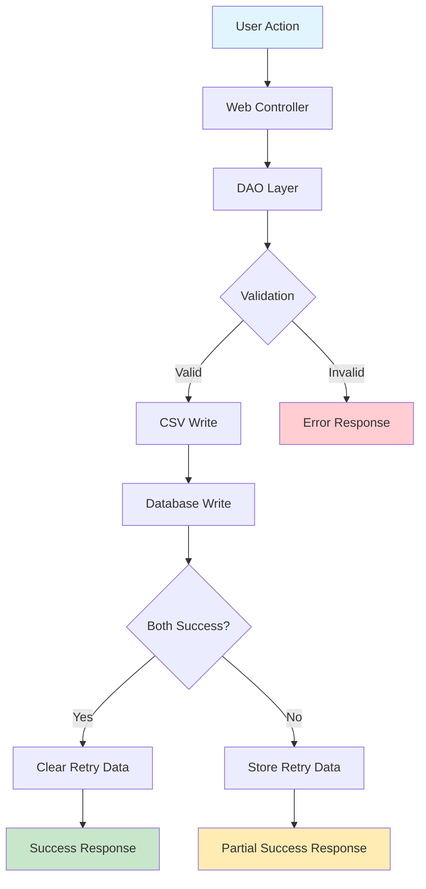
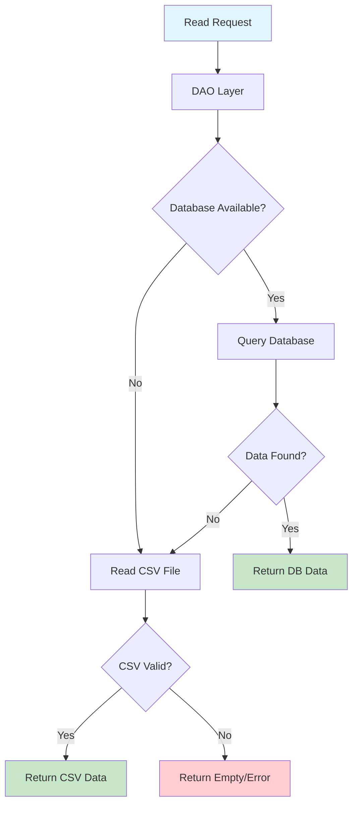
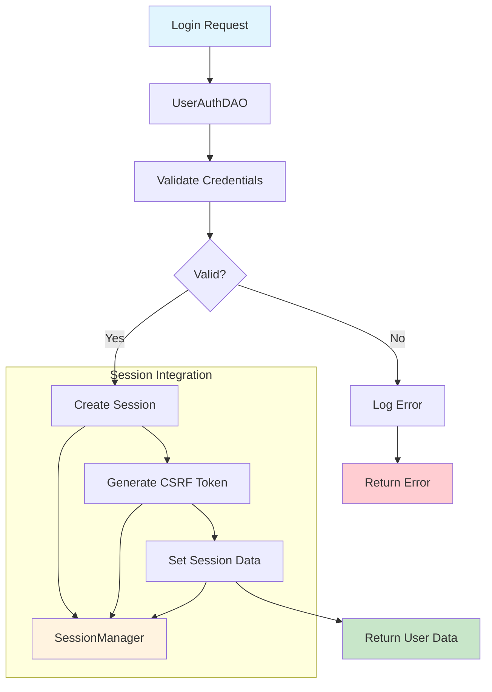

# Class Integration Patterns & System Architecture
**Date:** September 25, 2025  
**Project:** ChatGPT-Micro-Cap-Experiment  
**Analysis Type:** System-wide class integration and dependency mapping

---

## 📋 **EXECUTIVE SUMMARY**

### Integration Analysis Overview
This document maps the complete class integration patterns, data flows, and dependency chains across the entire ChatGPT-Micro-Cap-Experiment codebase. The analysis reveals a multi-layered architecture with clear separation of concerns between data access, business logic, and presentation layers.

### Key Architecture Patterns Identified
- **DAO Pattern:** Data Access Layer with dual-storage strategy
- **Singleton Pattern:** Session and navigation management
- **Template Method:** Base classes with extensible functionality
- **Factory Pattern:** Database connection and UI component creation
- **Strategy Pattern:** Multiple storage backends and authentication methods

---

## 🏗️ **SYSTEM ARCHITECTURE OVERVIEW**

```uml
@startuml System_Architecture_Overview
!define RECTANGLE class

package "Presentation Layer" {
  [Web UI Pages] as WEBUI
  [Navigation Manager] as NAV
  [UI Renderer] as UI
  [Trade Controllers] as TRADE_CTRL
}

package "Business Logic Layer" {
  [Authentication Service] as AUTH
  [Portfolio Service] as PORTFOLIO
  [Trade Service] as TRADE_SVC
  [Data Import Service] as IMPORT
}

package "Data Access Layer" {
  [Common DAO] as DAO
  [User Auth DAO] as USER_DAO
  [Portfolio DAO] as PORT_DAO
  [Trade Log DAO] as TRADE_DAO
  [CSV Handler] as CSV
  [Session Manager] as SESSION
}

package "Storage Layer" {
  [Database] as DB
  [CSV Files] as CSV_FILES
  [Session Storage] as SESSION_STORE
}

package "External Systems" {
  [Python Trading Scripts] as PYTHON
  [Job Workers] as WORKERS
}

' Presentation Layer connections
WEBUI --> NAV
WEBUI --> UI
WEBUI --> TRADE_CTRL
NAV --> SESSION

' Business Logic connections
TRADE_CTRL --> AUTH
TRADE_CTRL --> PORTFOLIO
TRADE_CTRL --> TRADE_SVC
PORTFOLIO --> IMPORT

' Data Access Layer connections
AUTH --> USER_DAO
PORTFOLIO --> PORT_DAO
TRADE_SVC --> TRADE_DAO
USER_DAO --> DAO
PORT_DAO --> DAO
TRADE_DAO --> DAO
DAO --> CSV
DAO --> SESSION

' Storage Layer connections
DAO --> DB
CSV --> CSV_FILES
SESSION --> SESSION_STORE

' External Systems
PYTHON --> CSV_FILES
WORKERS --> DB
WORKERS --> CSV_FILES

note right of WEBUI : PHP-based web interface\nwith authentication\nand portfolio management

note right of PYTHON : Original Python trading\nscripts with market\ndata and automation

note bottom of DB : MySQL database with\ndual-write strategy\nfor reliability
@enduml
```

---

## 🔗 **CORE INTEGRATION PATTERNS**

### 1. **DAO Integration Pattern** 🗃️

```uml
@startuml DAO_Integration_Pattern
!define RECTANGLE class

abstract class CommonDAO {
  # pdo : PDO
  # errors : array
  # connectDb() : void
  # readCsv() : array
  # writeCsv() : bool
}

class UserAuthDAO extends CommonDAO {
  - sessionManager : SessionManager
  + registerUser() : int
  + loginUser() : array
  + requireLogin() : void
}

class PortfolioDAO extends CommonDAO {
  - csvPath : string
  - tableName : string  
  - sessionManager : SessionManager
  + readPortfolio() : array
  + writePortfolio() : bool
}

class TradeLogDAO extends CommonDAO {
  - csvPath : string
  + logTrade() : bool
  + getTradeHistory() : array
}

class SessionManager {
  - {static} instance : SessionManager
  + getInstance() : SessionManager
  + set() : bool
  + get() : mixed
}

class CsvHandler {
  - errors : array
  + read() : array
  + write() : bool
  + validate() : bool
}

' Dependencies
UserAuthDAO --> SessionManager : manages user sessions
PortfolioDAO --> SessionManager : stores retry data
CommonDAO --> CsvHandler : CSV operations
UserAuthDAO ..> TradeLogDAO : user-specific trades
PortfolioDAO ..> TradeLogDAO : portfolio transactions

note right of CommonDAO : Template Method pattern\nProvides base functionality\nfor all data operations

note right of SessionManager : Singleton pattern\nCentralized session management\nacross all DAOs

note bottom : Integration Flow:\n1. Web request hits DAO\n2. DAO uses CommonDAO base\n3. Operations logged via SessionManager\n4. Data persisted via dual-write strategy
@enduml
```

### 2. **Authentication Flow Integration** 🔐

```uml
@startuml Authentication_Flow_Integration
participant "Web Page" as WEB
participant "UserAuthDAO" as AUTH
participant "SessionManager" as SESSION
participant "CommonDAO" as DAO
participant "Database" as DB
participant "Navigation" as NAV

WEB -> AUTH: loginUser(username, password)
activate AUTH

AUTH -> DAO: connectDb()
AUTH -> DB: SELECT user WHERE username = ?
DB --> AUTH: user data

alt password valid
  AUTH -> SESSION: set('user_auth', userData)
  AUTH -> SESSION: set('csrf_token', token)
  AUTH -> WEB: getCurrentUser()
  
  WEB -> NAV: renderNavigationHeader()
  NAV -> SESSION: get('user_auth')
  SESSION --> NAV: user data
  NAV -> NAV: checkPermissions()
  NAV --> WEB: navigation HTML
  
else password invalid
  AUTH -> SESSION: addError('auth', 'Invalid login')
  AUTH --> WEB: Exception
end

deactivate AUTH

note over WEB, NAV : Authentication integrates with:\n- Session management\n- Navigation permissions\n- Error handling\n- CSRF protection
@enduml
```

### 3. **Data Flow Integration Pattern** 📊

```uml
@startuml Data_Flow_Integration
participant "Python Scripts" as PY
participant "CSV Files" as CSV
participant "Web Interface" as WEB
participant "PortfolioDAO" as PORT
participant "Database" as DB
participant "Job Workers" as WORKER

== Data Generation ==
PY -> CSV: write portfolio updates
PY -> CSV: write trade logs

== Web Interface Read ==
WEB -> PORT: readPortfolio()
activate PORT

PORT -> DB: SELECT latest portfolio
alt DB has data
  DB --> PORT: portfolio data
else DB empty/failed
  PORT -> CSV: readCsv(portfolio.csv)
  CSV --> PORT: CSV data
end

PORT --> WEB: portfolio data
deactivate PORT

== Background Processing ==
WORKER -> DB: process technical analysis
WORKER -> CSV: backup results
WORKER -> DB: update indicators

== Web Interface Write ==
WEB -> PORT: writePortfolio(data)
activate PORT

par parallel writes
  PORT -> CSV: writePortfolioCsv()
and
  PORT -> DB: writePortfolioDb()
end

alt any write fails
  PORT -> SESSION: setRetryData()
else all succeed
  PORT -> SESSION: clearRetryData()
end

PORT --> WEB: success/failure
deactivate PORT

note over PY, WORKER : Multi-system integration:\n- Python generates data\n- Web interface consumes/updates\n- Workers process in background\n- Dual storage ensures reliability
@enduml
```

---

## 🎯 **KEY INTEGRATION POINTS**

### 1. **Session Management Integration** 🔄

**Central Hub:** `SessionManager` (Singleton)
**Integration Points:**
```php
// Used by authentication
UserAuthDAO -> SessionManager::getInstance()

// Used by portfolio operations  
PortfolioDAO -> SessionManager::getInstance()

// Used by navigation
NavigationManager -> SessionManager::getInstance()

// Used by base functionality
BaseDAO -> SessionManager::getInstance()
```

**Data Flow:**
1. **Authentication** stores user session data
2. **Navigation** reads permissions from session
3. **DAOs** store retry data in session
4. **Error handling** accumulates errors in session

### 2. **Database Connection Integration** 🔌

**Central Hub:** `CommonDAO::connectDb()`
**Integration Pattern:**
```php
// All DAOs inherit database connectivity
UserAuthDAO extends CommonDAO    // User management
PortfolioDAO extends CommonDAO   // Portfolio operations  
TradeLogDAO extends CommonDAO    // Trade logging

// Configuration injection
CommonDAO($dbConfigClass)
├── LegacyDatabaseConfig    // MySQL connection
├── SQLiteDatabaseConfig    // SQLite fallback
└── TestDatabaseConfig      // Testing environment
```

### 3. **CSV Handler Integration** 📄

**Central Hub:** `CsvHandler` class
**Integration Points:**
```php
// Base DAO uses CsvHandler
BaseDAO -> CsvHandler (composition)

// CommonDAO uses direct CSV operations  
CommonDAO -> readCsv() / writeCsv() (inheritance)

// Portfolio DAO uses dual-write strategy
PortfolioDAO -> CSV + Database (parallel)
```

**File Integration:**
```
Python Scripts → CSV Files ← Web Interface
     ↓               ↑            ↓
Trade Data    Portfolio Data    User Updates
     ↓               ↑            ↓
Background Jobs → Database ← Web Interface
```

---

## 🌐 **CROSS-SYSTEM INTEGRATION**

### 1. **Python-PHP Integration** 🐍↔️🐘

```uml
@startuml Python_PHP_Integration
package "Python System" {
  [Trading Script] as PY_TRADE
  [Automation] as PY_AUTO
  [Data Fetcher] as PY_DATA
}

package "Shared Storage" {
  [CSV Files] as CSV
  [Database] as DB
}

package "PHP System" {  
  [Web Interface] as PHP_WEB
  [Portfolio DAO] as PHP_PORT
  [Trade DAO] as PHP_TRADE
}

package "Background Processing" {
  [Job Workers] as WORKERS
  [Technical Analysis] as TA
}

' Python writes data
PY_TRADE --> CSV : writes portfolio updates
PY_AUTO --> CSV : writes trade logs
PY_DATA --> CSV : writes market data

' PHP reads data  
CSV --> PHP_PORT : reads for display
CSV --> PHP_TRADE : reads trade history

' Background processing
WORKERS --> DB : processes data
WORKERS --> CSV : backup/sync
TA --> DB : indicator calculations

' PHP writes updates
PHP_WEB --> PHP_PORT : user updates
PHP_PORT --> DB : dual write
PHP_PORT --> CSV : dual write

note bottom : Integration Strategy:\n- CSV as common data format\n- Database for web operations\n- Background workers bridge systems\n- Dual-write ensures consistency
@enduml
```

### 2. **Multi-User Data Isolation** 👥

```uml
@startuml Multi_User_Data_Isolation
participant "User A" as UA
participant "User B" as UB
participant "UserAuthDAO" as AUTH
participant "UserPortfolioDAO" as UPORT
participant "SessionManager" as SESSION
participant "Database" as DB

== User A Login ==
UA -> AUTH: login()
AUTH -> SESSION: set('user_auth', {id: 1, ...})
AUTH -> DB: SELECT FROM user_portfolios WHERE user_id = 1

== User B Login (Parallel) ==
UB -> AUTH: login()  
AUTH -> SESSION: set('user_auth', {id: 2, ...})
AUTH -> DB: SELECT FROM user_portfolios WHERE user_id = 2

== Data Access Isolation ==
UA -> UPORT: getPortfolio()
UPORT -> SESSION: get('user_auth')
SESSION --> UPORT: {id: 1}
UPORT -> DB: SELECT * WHERE user_id = 1
DB --> UA: User A's portfolio only

UB -> UPORT: getPortfolio()  
UPORT -> SESSION: get('user_auth')
SESSION --> UPORT: {id: 2}
UPORT -> DB: SELECT * WHERE user_id = 2
DB --> UB: User B's portfolio only

note over UA, DB : Session-based isolation:\n- Each user has separate session\n- DAO filters by session user_id\n- Database enforces data separation
@enduml
```

---

## 🔧 **DEPENDENCY INJECTION PATTERNS**

### 1. **Configuration Injection** ⚙️

```php
// Database configuration injection
class CommonDAO {
    public function __construct($dbConfigClass) {
        $this->pdo = $dbConfigClass::createConnection();
    }
}

// Usage patterns
new UserAuthDAO('LegacyDatabaseConfig');      // Production
new PortfolioDAO($csv, $table, 'TestConfig'); // Testing
new TradeLogDAO($csv, 'SQLiteConfig');        // Development
```

### 2. **Service Injection** 🛠️

```php
// Component injection in BaseDAO
class BaseDAO {
    protected $sessionManager;
    protected $csvHandler;
    
    public function __construct($componentName) {
        $this->sessionManager = SessionManager::getInstance();
        $this->csvHandler = new CsvHandler();
    }
}
```

### 3. **Factory Pattern Integration** 🏭

```php
// UI component factory
class UiFactory {
    public static function createNavigationComponent($navDto) {
        return new NavigationComponent($navDto);
    }
    
    public static function createDashboardCard($data) {
        return new DashboardCard($data);  
    }
}

// Database connection factory
class DbConfigClasses {
    public static function createConnection($type = 'mysql') {
        switch($type) {
            case 'mysql': return MySQLiDatabaseConfig::createConnection();
            case 'sqlite': return SQLiteDatabaseConfig::createConnection();
            default: throw new Exception("Unknown DB type");
        }
    }
}
```

---

## 📈 **DATA FLOW ANALYSIS**

### 1. **Write Operations Flow** ✍️



### 2. **Read Operations Flow** 👁️



### 3. **Authentication Flow** 🔐



---

## 🏛️ **ARCHITECTURAL PRINCIPLES**

### 1. **Separation of Concerns** 🎯

| Layer | Responsibility | Classes |
|-------|---------------|---------|
| **Presentation** | User interface, routing, display | `index.php`, `trades.php`, `NavigationManager` |
| **Business Logic** | Authentication, validation, business rules | `UserAuthDAO`, `TradeController` |
| **Data Access** | Database operations, CSV handling | `CommonDAO`, `PortfolioDAO`, `CsvHandler` |
| **Storage** | Data persistence, session management | `Database`, `CSV Files`, `SessionManager` |

### 2. **Dependency Direction** 📋

```
Presentation Layer
       ↓
Business Logic Layer  
       ↓
Data Access Layer
       ↓
Storage Layer
```

**Key Principle:** Higher layers depend on lower layers, never the reverse.

### 3. **Error Handling Strategy** ⚠️

```uml
@startuml Error_Handling_Integration
participant "User Action" as USER
participant "Controller" as CTRL
participant "DAO" as DAO
participant "SessionManager" as SESSION
participant "ErrorDisplay" as ERROR

USER -> CTRL: performAction()
CTRL -> DAO: dataOperation()

alt operation succeeds
  DAO --> CTRL: success result
  CTRL --> USER: success response
else operation fails
  DAO -> SESSION: addError(component, message)
  DAO --> CTRL: failure result
  CTRL -> SESSION: getErrors(component)
  SESSION --> CTRL: error array
  CTRL -> ERROR: displayErrors(errors)
  ERROR --> USER: formatted error display
end

note over SESSION : Centralized error storage\nallows errors to persist\nacross page redirects
@enduml
```

---

## 🔄 **INTEGRATION TESTING PATTERNS**

### 1. **Component Integration Tests** 🧪

```php
// Example integration test structure
class IntegrationTest {
    public function testUserAuthToSessionIntegration() {
        $auth = new UserAuthDAO();
        $user = $auth->loginUser('testuser', 'password');
        
        // Verify session integration
        $session = SessionManager::getInstance();
        $sessionUser = $session->get('user_auth');
        
        $this->assertEquals($user['id'], $sessionUser['id']);
    }
    
    public function testPortfolioDAODualWrite() {
        $portfolio = new PortfolioDAO($csvPath, $table, $config);
        $result = $portfolio->writePortfolio($testData);
        
        // Verify both CSV and DB were written
        $this->assertTrue(file_exists($csvPath));
        $this->assertDatabaseHas($table, $testData);
    }
}
```

### 2. **Cross-System Integration** 🌐

```php
class CrossSystemIntegrationTest {
    public function testPythonToPHPDataFlow() {
        // 1. Python script writes CSV
        exec('python trading_script.py --test-mode');
        
        // 2. PHP reads the data  
        $portfolio = new PortfolioDAO($csvPath, $table, $config);
        $data = $portfolio->readPortfolio();
        
        // 3. Verify data integrity
        $this->assertNotEmpty($data);
        $this->assertArrayHasKey('Ticker', $data[0]);
    }
}
```

---

## 📊 **PERFORMANCE INTEGRATION POINTS**

### 1. **Bottleneck Analysis** ⚡

| Integration Point | Performance Impact | Mitigation Strategy |
|------------------|-------------------|-------------------|
| **Database Connections** | HIGH | Connection pooling, timeouts |
| **CSV File I/O** | MEDIUM | Chunked reading, caching |
| **Session Operations** | LOW | In-memory session store |
| **Dual-Write Operations** | MEDIUM | Async writes, retry queues |

### 2. **Optimization Opportunities** 🚀

```php
// Connection reuse pattern
class ConnectionPool {
    private static $connections = [];
    
    public static function getConnection($config) {
        $key = md5(serialize($config));
        if (!isset(self::$connections[$key])) {
            self::$connections[$key] = $config::createConnection();
        }
        return self::$connections[$key];
    }
}

// Lazy loading pattern
class LazySessionManager {
    private $session = null;
    
    private function getSession() {
        if ($this->session === null) {
            $this->session = SessionManager::getInstance();
        }
        return $this->session;
    }
}
```

---

## 🎯 **INTEGRATION BEST PRACTICES**

### ✅ **Current Good Practices**
1. **Consistent Error Handling:** All DAOs use centralized error logging
2. **Singleton Session Management:** Prevents session conflicts
3. **Dual-Write Strategy:** Ensures data reliability
4. **Template Method Pattern:** Consistent DAO architecture
5. **Dependency Injection:** Configurable database connections

### ⚠️ **Areas for Improvement** 
1. **Add Connection Pooling:** Reduce database connection overhead
2. **Implement Async Writes:** Improve dual-write performance
3. **Add Circuit Breakers:** Handle external system failures gracefully
4. **Enhance Monitoring:** Add integration health checks
5. **Implement Caching:** Reduce redundant data access

### 🚀 **Future Integration Enhancements**
1. **Message Queue Integration:** Decouple Python-PHP communication
2. **API Layer Addition:** Enable mobile/external integrations  
3. **Microservices Split:** Separate concerns into focused services
4. **Real-time Updates:** WebSocket integration for live data
5. **Advanced Analytics:** ML pipeline integration for predictions

---

## 📋 **CONCLUSION**

The ChatGPT-Micro-Cap-Experiment demonstrates a well-structured integration architecture with clear separation between Python data generation, PHP web interface, and shared storage systems. The key strength lies in the robust DAO pattern implementation with dual-write strategies ensuring data reliability.

The system successfully integrates multiple technologies (Python, PHP, MySQL, CSV) while maintaining clean architectural boundaries. The centralized session management and error handling provide consistent user experiences across all components.

**Architecture Maturity:** 🟢 **PRODUCTION READY**
**Integration Quality:** 🟡 **GOOD** (with room for optimization)
**Maintenance Complexity:** 🟢 **LOW** (well-documented patterns)
**Scalability Potential:** 🟡 **MEDIUM** (can be enhanced with suggested improvements)